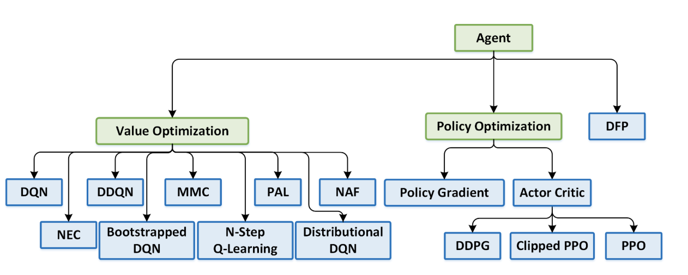
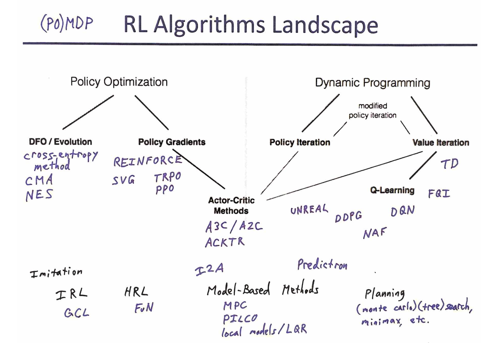
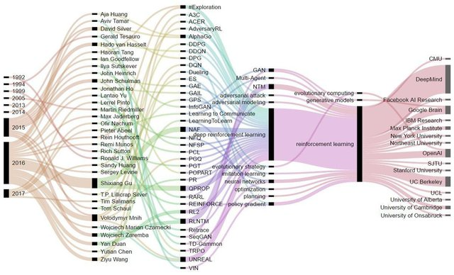
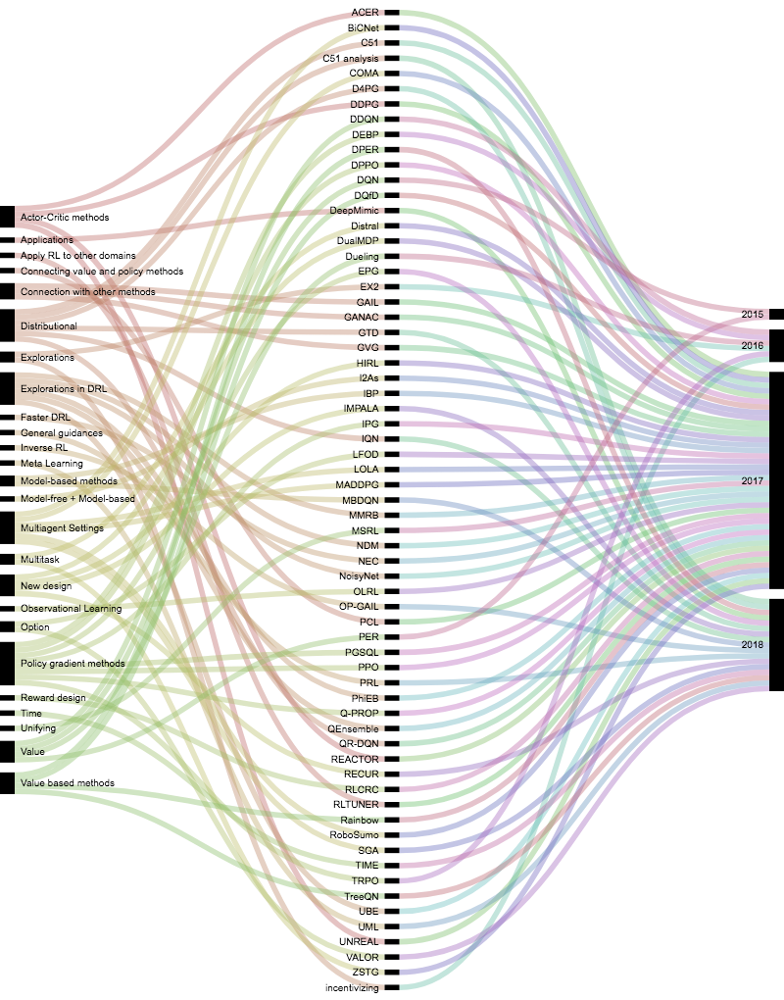
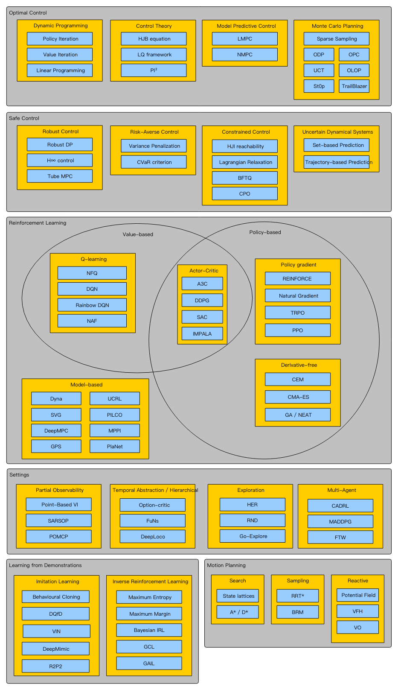
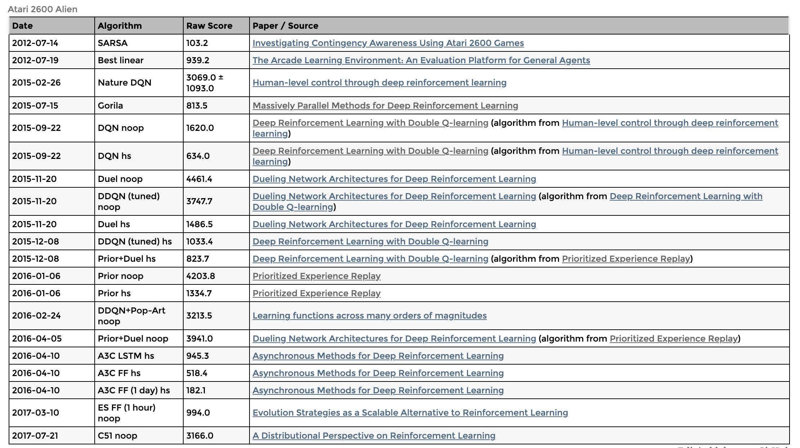
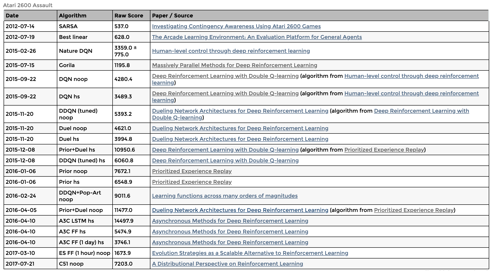
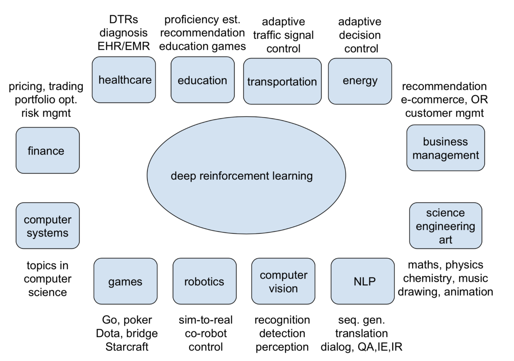

## A Guide Resource for Deep Reinforcement Learning

**1. About this work**: 
> This deep intensive learning database was initiated by the 【 *Deep Reinforcement Learning Laboratory(DeepRL-Lab)* 】and was jointly created by more than ** Ph.D. doctors and experts in the field. The goal is to enable each learner to make rapid progress and acquire relevant knowledge.  

**2. How to contribute？**: 
> This project welcomes the contribution of each reinforcement learner, can be submitted according to their knowledge accumulation in a certain direction, and will be included in the list of contributors. 

**3. How to communicate？**: 
> Welcome to the WeChat public (Deep-RL) and add WeChat Assistant (NeuronDance), note: "Name - School / Unit - Direction"

---
Contents
----
- __[1. Books](#Books)__
- __[2. Courses](#Courses)__
- __[3. Survey-and-Frontier](#Survey-and-Frontier)__
- __[4. Environment-and-Framework](#Environment-and-Framework)__
- __[5. Baselines-and-Benchmarks](#Baselines-and-Benchmarks)__
- __[6. Algorithm](#Algorithms)__
- __[7. Applications](#Applications)__
- __[8. Advanced-Topics](#Advanced-Topics)__
- __[9. Relate-Coureses](#Relate-Coureses)__
- __[10. Multi-Agents](#Multi-Agents)__
- __[11. Paper-Resources](#Paper-Resources)__
- __[12.Contributors](#Cite)__

---
#1. Books
-----
1. [Reinforcement Learning: An Introduction](http://incompleteideas.net/book/bookdraft2017nov5.pdf) by Richard S. Sutton and Andrew G. Barto (2017),[Chinese-Edtion](https://rl.qiwihui.com/zh_CN/latest/index.html), [Code](http://www.incompleteideas.net/book/code/code2nd.html)
2. [Algorithms for Reinforcement Learning](https://sites.ualberta.ca/~szepesva/papers/RLAlgsInMDPs.pdf) by Csaba Szepesvari (updated 2019)
3. [Deep Reinforcement Learning Hands-On](https://www.amazon.com/Deep-Reinforcement-Learning-Hands-Q-networks/dp/1788834240) by Maxim Lapan (2018),[Code](https://github.com/PacktPublishing/Deep-Reinforcement-Learning-Hands-On)
4. [Reinforcement learning, State-Of-The- Art](https://github.com/yangmingustb/planning_books_1/blob/master/Reinforcement%20learning%20state%20of%20the%20art.pdf) by Marco Wiering, Martijin van Otterlo
5. [Deep Reinforcement Learning in Action](https://www.manning.com/books/deep-reinforcement-learning-in-action) by Alexander Zai and Brandon Brown (in progress)
6. [Grokking Deep Reinforcement Learning](https://www.manning.com/books/grokking-deep-reinforcement-learning) by Miguel Morales (in progress)
7. [Multi-Agent Machine Learning A Reinforcement Approach【百度云链接】]() by Howard M.Schwartz(2017)
8. [强化学习在阿里的技术演进与业务创新](https://alitech-private.oss-cn-beijing.aliyuncs.com/1517812754285/reinforcement_learning.pdf?Expires=1572504433&OSSAccessKeyId=LTAIqKGWQyF6Vd3W&Signature=gqCg4wSejW2sqWNluFDQebMWA94%3D) by Alibaba Group
9. [Hands-On Reinforcement Learning with Python(百度云链接)]()
10. [Reinforcement Learning And Optimal Control](http://web.mit.edu/dimitrib/www/RLbook.html) by Dimitri P. Bertsekas, 2019

---
#2. Courses
----

1. [UCL Course on RL(★★★)](http://www0.cs.ucl.ac.uk/staff/d.silver/web/Teaching.html) by David Sliver, [Video-en](https://www.youtube.com/watch?v=2pWv7GOvuf0&list=PLqYmG7hTraZDM-OYHWgPebj2MfCFzFObQ),[Video-zh](https://www.bilibili.com/video/av51567407/)
2. [OpenAI's Spinning Up in Deep RL](https://spinningup.openai.com/en/latest/) by OpenAI(2018)
3. [Udacity-Deep Reinforcement learning](https://cn.udacity.com/course/deep-reinforcement-learning-nanodegree--nd893-cn), 2019-10-31
4. [Stanford CS-234: Reinforcement Learning](http://web.stanford.edu/class/cs234/index.html) (2019), [Videos](https://www.youtube.com/playlist?list=PLoROMvodv4rOSOPzutgyCTapiGlY2Nd8u)
5. [DeepMind Advanced Deep Learning & Reinforcement Learning](http://www.cs.ucl.ac.uk/current_students/syllabus/undergrad/compmi22_advanced_deep_learning_and_reinforcement_learning/) (2018),[Videos](https://www.youtube.com/playlist?list=PLqYmG7hTraZDNJre23vqCGIVpfZ_K2RZs)

6. [GeorgiaTech CS-8803 Deep Reinforcement Learning](https://www.udacity.com/course/reinforcement-learning--ud600) (2018?)
7. [UC Berkeley CS294-112 Deep Reinforcement Learning](http://rail.eecs.berkeley.edu/deeprlcourse/) (2018 Fall),[Video-zh](https://www.bilibili.com/video/av39816961)
8. [Deep RL Bootcamp](https://sites.google.com/view/deep-rl-bootcamp/lectures) by  Berkeley CA(2017)
9. [Thomas Simonini's Deep Reinforcement Learning Course](https://simoninithomas.github.io/Deep_reinforcement_learning_Course/)
10. [CS-6101 Deep Reinforcement Learning ](https://www.comp.nus.edu.sg/~kanmy/courses/6101_1820/), NUS SoC, 2018/2019, Semester II
11. [Course on Reinforcement Learning](http://researchers.lille.inria.fr/~lazaric/Webpage/MVA-RL_Course17.html) by Alessandro Lazaric，2018
12. [Learn Deep Reinforcement Learning in 60 days](https://github.com/andri27-ts/Reinforcement-Learning)

---
#3. Survey-and-Frontier
----
1. [Deep Reinforcement Learning](https://arxiv.org/pdf/1810.06339.pdf) by Yuxi Li
2. [Algorithms for Reinforcement Learning](https://sites.ualberta.ca/~szepesva/papers/RLAlgsInMDPs.pdf) by Morgan & Claypool, 2009
3. [Modern Deep Reinforcement Learning Algorithms](https://arxiv.org/pdf/1906.10025v1.pdf) by Sergey Ivanov(54-Page)
4. [Deep Reinforcement Learning: An Overview](https://arxiv.org/abs/1806.08894) (2018)
5. [A Brief Survey of Deep Reinforcement Learning](https://arxiv.org/abs/1708.05866) (2017)

6. [Deep Reinforcement Learning Doesn't Work Yet（★）](https://www.alexirpan.com/2018/02/14/rl-hard.html) by Irpan, Alex(2018), [ChineseVersion](https://zhuanlan.zhihu.com/p/34089913)

7. [Deep Reinforcement Learning that Matters(★)](https://arxiv.org/pdf/1709.06560.pdf) by Peter Henderson1, Riashat Islam1
7. [A Survey of Inverse Reinforcement Learning: Challenges, Methods and Progress](https://arxiv.org/pdf/1806.06877v1.pdf)
8. [Applications of Deep Reinforcement Learning in Communications and Networking: A Survey](https://arxiv.org/pdf/1810.07862v1.pdf)

9. [An Introduction to Deep Reinforcement Learning](https://arxiv.org/pdf/1811.12560v2.pdf)
10. [Challenges of Real-World Reinforcement Learning](https://arxiv.org/pdf/1904.12901v1.pdf)
11. [Topics in Reinforcement Learning](http://www-anw.cs.umass.edu/rlr/)

12.  [Reinforcement Learning: A Survey](https://arxiv.org/pdf/cs/9605103.pdf),1996.
13.  [A Tutorial Survey of Reinforcement Learning, Sadhana](http://www.cse.iitm.ac.in/~ravi/papers/keerthi.rl-survey.pdf),1994. 
14. [Reinforcement Learning in Robotics, A Survey](http://www.ias.tu-darmstadt.de/uploads/Publications/Kober_IJRR_2013.pdf), 2013
15. [A Survey of Deep Network Solutions for Learning Control in Robotics: From Reinforcement to Imitation.](https://arxiv.org/abs/1612.07139v4), 2018
16. [Universal Reinforcement Learning Algorithms: Survey and Experiments](https://arxiv.org/abs/1705.10557v1),2017
17. [Bayesian Reinforcement Learning: A Survey](https://arxiv.org/pdf/1609.04436v1.pdf), 2016
18. [Benchmarking Reinforcement Learning Algorithms on Real-World Robots](https://arxiv.org/pdf/1809.07731v1.pdf)

---

#4. Environment-and-Framework
----
- [OpenAI Gym](https://gym.openai.com) ([GitHub](https://github.com/openai/gym)) ([docs](https://gym.openai.com/docs/))

- rllab ([GitHub](https://github.com/rll/rllab)) ([readthedocs](http://rllab.readthedocs.io))
- Ray [(Doc)](https://ray.readthedocs.io/en/latest/index.html)
- Dopamine: https://github.com/google/dopamine (uses some tensorflow)
- trfl: https://github.com/deepmind/trfl (uses tensorflow)
-  ChainerRL ([GitHub](https://github.com/chainer/chainerrl)) (API: Python)
- Surreal [GitHub](https://github.com/SurrealAI/surreal)  (API: Python) (support: Stanford Vision and Learning Lab).[Paper](https://surreal.stanford.edu/img/surreal-corl2018.pdf)
- PyMARL [GitHub](https://github.com/oxwhirl/pymarl) (support: http://whirl.cs.ox.ac.uk/)
- TF-Agents: https://github.com/tensorflow/agents (uses tensorflow)
- TensorForce ([GitHub](https://github.com/reinforceio/tensorforce)) (uses tensorflow)
- [RL-Glue](https://sites.google.com/a/rl-community.org/rl-glue/Home/rl-glue) ([Google Code Archive](https://code.google.com/archive/p/rl-glue-ext/wikis/RLGlueCore.wiki)) (API: C/C++, Java, Matlab, Python, Lisp) (support: Alberta)
- MAgent https://github.com/geek-ai/MAgent (uses tensorflow)
- RLlib http://ray.readthedocs.io/en/latest/rllib.html (API: Python)
- http://burlap.cs.brown.edu/ (API: Java)
- [rlpyt: A Research Code Base for Deep Reinforcement Learning in PyTorch](https://bair.berkeley.edu/blog/2019/09/24/rlpyt/)
- [robotics-rl-srl](https://github.com/araffin/robotics-rl-srl) - S-RL Toolbox: Reinforcement Learning (RL) and State Representation Learning (SRL) for Robotics
- [pysc2: StarCraft II Learning Environment](https://github.com/deepmind/pysc2)
- [Arcade-Learning-Environment](https://github.com/mgbellemare/Arcade-Learning-Environment)
- [OpenAI universe](https://github.com/openai/universe) - A software platform for measuring and training an AI's general intelligence across the world's supply of games, websites and other applications
- [DeepMind Lab](https://github.com/deepmind/lab) - A customisable 3D platform for agent-based AI research
- [Project Malmo](https://github.com/Microsoft/malmo) - A platform for Artificial Intelligence experimentation and research built on top of Minecraft by Microsoft
- [Retro Learning Environment](https://github.com/nadavbh12/Retro-Learning-Environment) - An AI platform for reinforcement learning based on video game emulators. Currently supports SNES and Sega Genesis. Compatible with OpenAI gym.
- [torch-twrl](https://github.com/twitter/torch-twrl) - A package that enables reinforcement learning in Torch by Twitter
- [UETorch](https://github.com/facebook/UETorch) - A Torch plugin for Unreal Engine 4 by Facebook
- [TorchCraft](https://github.com/TorchCraft/TorchCraft) - Connecting Torch to StarCraft
- [rllab](https://github.com/openai/rllab) - A framework for developing and evaluating reinforcement learning algorithms, fully compatible with OpenAI Gym
- [TensorForce](https://github.com/reinforceio/tensorforce) - Practical deep reinforcement learning on TensorFlow with Gitter support and OpenAI Gym/Universe/DeepMind Lab integration.
- [OpenAI lab](https://github.com/kengz/openai_lab) - An experimentation system for Reinforcement Learning using OpenAI Gym, Tensorflow, and Keras.
- [keras-rl](https://github.com/matthiasplappert/keras-rl) - State-of-the art deep reinforcement learning algorithms in Keras designed for compatibility with OpenAI.
- [BURLAP](http://burlap.cs.brown.edu) - Brown-UMBC Reinforcement Learning and Planning, a library written in Java
- [MAgent](https://github.com/geek-ai/MAgent) - A Platform for Many-agent Reinforcement Learning. 
- [Ray RLlib](http://ray.readthedocs.io/en/latest/rllib.html) - Ray RLlib is a reinforcement learning library that aims to provide both performance and composability.
- [SLM Lab](https://github.com/kengz/SLM-Lab) - A research framework for Deep Reinforcement Learning using Unity, OpenAI Gym, PyTorch, Tensorflow.
- [Unity ML Agents](https://github.com/Unity-Technologies/ml-agents) - Create reinforcement learning environments using the Unity Editor
- [Intel Coach](https://github.com/NervanaSystems/coach) - Coach is a python reinforcement learning research framework containing implementation of many state-of-the-art algorithms.
- [ELF](https://github.com/facebookresearch/ELF) - An End-To-End, Lightweight and Flexible Platform for Game Research
- [Unity ML-Agents Toolkit](https://arxiv.org/pdf/1809.02627v1.pdf)
- [rlkit](https://github.com/vitchyr/rlkit)
- https://gym.openai.com/envs/#classic_control
- https://github.com/erlerobot/gym-gazebo
- https://github.com/robotology/gym-ignition
- https://github.com/dartsim/gym-dart
- https://github.com/Roboy/gym-roboy
- https://github.com/openai/retro
- https://github.com/openai/gym-soccer
- https://github.com/duckietown/gym-duckietown
- https://github.com/Unity-Technologies/ml-agents (Unity, multiagent)
- https://github.com/koulanurag/ma-gym (multiagent)
- https://github.com/ucuapps/modelicagym
- https://github.com/mwydmuch/ViZDoom
- https://github.com/benelot/pybullet-gym
- https://github.com/Healthcare-Robotics/assistive-gym
- https://github.com/Microsoft/malmo
- https://github.com/nadavbh12/Retro-Learning-Environment
- https://github.com/twitter/torch-twrl

- https://github.com/arex18/rocket-lander
- https://github.com/ppaquette/gym-doom
- https://github.com/thedimlebowski/Trading-Gym
- https://github.com/Phylliade/awesome-openai-gym-environments
- https://github.com/deepmind/pysc2 (by DeepMind) (Blizzard StarCraft II Learning Environment (SC2LE) component)

---

#5. Baselines-and-Benchmarks
---
1. https://github.com/openai/baselines [【stalbe-baseline】](https://github.com/hill-a/stable-baselines)
2. [rl-baselines-zoo](https://github.com/araffin/rl-baselines-zoo)
3. [ROBEL](https://sites.google.com/view/roboticsbenchmarks) ([google-research/robel](https://github.com/google-research/robel/))
4. [RLBench](https://sites.google.com/view/rlbench) ([stepjam/RLBench](https://github.com/stepjam/RLBench))
5. https://martin-thoma.com/sota/#reinforcment-learning
6. https://github.com/rlworkgroup/garage
7. [Atari Environments Scores](https://www.endtoend.ai/envs/gym/atari/)

---

#6. Algorithms
----

###### 1. DQN serial

  1. Playing Atari with Deep Reinforcement Learning [[arxiv]](https://www.cs.toronto.edu/~vmnih/docs/dqn.pdf) [[code]](https://github.com/higgsfield/RL-Adventure/blob/master/1.dqn.ipynb)
  2. Deep Reinforcement Learning with Double Q-learning [[arxiv]](https://arxiv.org/abs/1509.06461) [[code]](https://github.com/higgsfield/RL-Adventure/blob/master/2.double%20dqn.ipynb)
  3. Dueling Network Architectures for Deep Reinforcement Learning [[arxiv]](https://arxiv.org/abs/1511.06581) [[code]](https://github.com/higgsfield/RL-Adventure/blob/master/3.dueling%20dqn.ipynb)
  4. Prioritized Experience Replay [[arxiv]](https://arxiv.org/abs/1511.05952) [[code]](https://github.com/higgsfield/RL-Adventure/blob/master/4.prioritized%20dqn.ipynb)
  5. Noisy Networks for Exploration [[arxiv]](https://arxiv.org/abs/1706.10295) [[code]](https://github.com/higgsfield/RL-Adventure/blob/master/5.noisy%20dqn.ipynb)
  6. A Distributional Perspective on Reinforcement Learning [[arxiv]](https://arxiv.org/pdf/1707.06887.pdf) [[code]](https://github.com/higgsfield/RL-Adventure/blob/master/6.categorical%20dqn.ipynb)
  7. Rainbow: Combining Improvements in Deep Reinforcement Learning [[arxiv]](https://arxiv.org/abs/1710.02298) [[code]](https://github.com/higgsfield/RL-Adventure/blob/master/7.rainbow%20dqn.ipynb)

###### 2. Others 

#####  Algorithm Codeing
 1. [Deep-Reinforcement-Learning-Algorithms-with-PyTorch](https://github.com/p-christ/Deep-Reinforcement-Learning-Algorithms-with-PyTorch)

---
#7. Applications
----

#### 7.1  Basic
1. [Reinforcement Learning Applications](https://medium.com/@yuxili/rl-applications-73ef685c07eb)
2. [IntelliLight: A Reinforcement Learning Approach for Intelligent Traffic Light Control](https://faculty.ist.psu.edu/jessieli/Publications/2018-KDD-IntelliLight.pdf) by Hua Wei，Guanjie Zheng(2018)
3. [Deep Reinforcement Learning](https://arxiv.org/pdf/1810.06339v1.pdf) by Yuxi Li, 2018
4. [Deep Reinforcement Learning in Robotics](https://github.com/dusty-nv/jetson-reinforcement)
#### 7.2  Robotics
  - Policy Gradient Reinforcement Learning for Fast Quadrupedal Locomotion (Kohl, ICRA 2004) [[Paper]](http://www.cs.utexas.edu/~pstone/Papers/bib2html-links/icra04.pdf)
  - Robot Motor SKill Coordination with EM-based Reinforcement Learning (Kormushev, IROS 2010) [[Paper]](http://kormushev.com/papers/Kormushev-IROS2010.pdf) [[Video]](https://www.youtube.com/watch?v=W_gxLKSsSIE)
  - Generalized Model Learning for Reinforcement Learning on a Humanoid Robot (Hester, ICRA 2010) [[Paper]](https://ccc.inaoep.mx/~mdprl/documentos/Hester_2010.pdf) [[Video]](https://www.youtube.com/watch?v=mRpX9DFCdwI&list=PL5nBAYUyJTrM48dViibyi68urttMlUv7e&index=12)
  - Autonomous Skill Acquisition on a Mobile Manipulator (Konidaris, AAAI 2011) [[Paper]](http://lis.csail.mit.edu/pubs/konidaris-aaai11b.pdf) [[Video]](https://www.youtube.com/watch?v=yUICAkSQTZY)
  - PILCO: A Model-Based and Data-Efficient Approach to Policy Search (Deisenroth, ICML 2011) [[Paper]](http://mlg.eng.cam.ac.uk/pub/pdf/DeiRas11.pdf)
  - Incremental Semantically Grounded Learning from Demonstration (Niekum, RSS 2013) [[Paper]](http://people.cs.umass.edu/~sniekum/pubs/NiekumRSS2013.pdf)
  - Efficient Reinforcement Learning for Robots using Informative Simulated Priors (Cutler, ICRA 2015) [[Paper]](http://markjcutler.com/papers/Cutler15_ICRA.pdf) [[Video]](https://www.youtube.com/watch?v=kKClFx6l1HY)
  - Robots that can adapt like animals (Cully, Nature 2015) [[Paper](https://arxiv.org/abs/1407.3501)] [[Video](https://www.youtube.com/watch?v=T-c17RKh3uE)] [[Code](https://github.com/resibots/cully_2015_nature)]
  - Black-Box Data-efficient Policy Search for Robotics (Chatzilygeroudis, IROS 2017) [[Paper](https://arxiv.org/abs/1703.07261)] [[Video](https://www.youtube.com/watch?v=kTEyYiIFGPM)] [[Code](https://github.com/resibots/blackdrops)]

---
#8. Advanced-Topics
----
#### 8.1. Model-free RL
1. **playing atari with deep reinforcement learning** NIPS Deep Learning Workshop 2013. [paper](https://www.cs.toronto.edu/~vmnih/docs/dqn.pdf)

    *Volodymyr Mnih, Koray Kavukcuoglu, David Silver, Alex Graves, Ioannis Antonoglou, Daan Wierstra, Martin Riedmiller*

2. **Human-level control through deep reinforcement learning** Nature 2015. [paper](https://www.nature.com/articles/nature14236)

    *Volodymyr Mnih, Koray Kavukcuoglu, David Silver, Andrei A. Rusu, Joel Veness, Marc G. Bellemare, Alex Graves, Martin Riedmiller, Andreas K. Fidjeland, Georg Ostrovski, Stig Petersen, Charles Beattie, Amir Sadik, Ioannis Antonoglou, Helen King, Dharshan Kumaran, Daan Wierstra, Shane Legg & Demis Hassabis*

3. **Deep Reinforcement Learning with Double Q-learning** AAAI 16. [paper](https://arxiv.org/abs/1509.06461)

    *Hado van Hasselt, Arthur Guez, David Silver*

4. **Dueling Network Architectures for Deep Reinforcement Learning** ICML16. [paper](https://arxiv.org/abs/1511.06581)

    *Ziyu Wang, Tom Schaul, Matteo Hessel, Hado van Hasselt, Marc Lanctot, Nando de Freitas*

5. **Deep Recurrent Q-Learning for Partially Observable MDPs** AAA15. [paper](https://arxiv.org/abs/1507.06527)

    *Matthew Hausknecht, Peter Stone*

6. **Prioritized Experience Replay** ICLR 2016. [paper](https://arxiv.org/abs/1507.06527)

    *Tom Schaul, John Quan, Ioannis Antonoglou, David Silver*

7. **Asynchronous Methods for Deep Reinforcement Learning** ICML2016. [paper](https://arxiv.org/abs/1602.01783)

    *Volodymyr Mnih, Adrià Puigdomènech Badia, Mehdi Mirza, Alex Graves, Timothy P. Lillicrap, Tim Harley, David Silver, Koray Kavukcuoglu*

8. **A Distributional Perspective on Reinforcement Learning** ICML2017. [paper](https://arxiv.org/abs/1707.06887)

    *Marc G. Bellemare, Will Dabney, Rémi Munos*

9. **Noisy Networks for Exploration** ICLR2018. [paper](https://arxiv.org/abs/1706.10295)

    *Meire Fortunato, Mohammad Gheshlaghi Azar, Bilal Piot, Jacob Menick, Ian Osband, Alex Graves, Vlad Mnih, Remi Munos, Demis Hassabis, Olivier Pietquin, Charles Blundell, Shane Legg*

10. **Rainbow: Combining Improvements in Deep Reinforcement Learning** AAAI2018. [paper](https://arxiv.org/abs/1710.02298)

    *Matteo Hessel, Joseph Modayil, Hado van Hasselt, Tom Schaul, Georg Ostrovski, Will Dabney, Dan Horgan, Bilal Piot, Mohammad Azar, David Silver*

#### 8.2. Model-based RL
1. **Sample-Efficient Reinforcement Learning with Stochastic Ensemble Value Expansion** NIPS2018. [paper](https://arxiv.org/abs/1807.01675)

    *Jacob Buckman, Danijar Hafner, George Tucker, Eugene Brevdo, Honglak Lee*

2. **Model-Based Value Estimation for Efficient Model-Free Reinforcement Learning**  ICML2018.[paper](https://arxiv.org/abs/1803.00101)

    *Vladimir Feinberg, Alvin Wan, Ion Stoica, Michael I. Jordan, Joseph E. Gonzalez, Sergey Levine*

3. **Value Prediction Network** NIPS2017. [paper](https://arxiv.org/abs/1707.03497)

    *Vladimir Feinberg, Alvin Wan, Ion Stoica, Michael I. Jordan, Joseph E. Gonzalez, Sergey Levine*

4. **Imagination-Augmented Agents for Deep Reinforcement Learning** NIPS2017. [paper](https://arxiv.org/abs/1707.06203)

    *Théophane Weber, Sébastien Racanière, David P. Reichert, Lars Buesing, Arthur Guez, Danilo Jimenez Rezende, Adria Puigdomènech Badia, Oriol Vinyals, Nicolas Heess, Yujia Li, Razvan Pascanu, Peter Battaglia, Demis Hassabis, David Silver, Daan Wierstra*

5. **Continuous Deep Q-Learning with Model-based Acceleration** ICML2016. [paper](https://arxiv.org/abs/1603.00748)

    *Shixiang Gu, Timothy Lillicrap, Ilya Sutskever, Sergey Levine*

6. **Uncertainty-driven Imagination for Continuous Deep Reinforcement Learning** CoRL2017. [paper](http://proceedings.mlr.press/v78/kalweit17a/kalweit17a.pdf)

    *Gabriel Kalweit, Joschka Boedecker*

7. **Model-Ensemble Trust-Region Policy Optimization** ICLR2018. [paper](https://arxiv.org/abs/1802.10592)

    *Thanard Kurutach, Ignasi Clavera, Yan Duan, Aviv Tamar, Pieter Abbeel*

8. **Deep Reinforcement Learning in a Handful of Trials using Probabilistic Dynamics Models** NIPS2018. [paper](https://arxiv.org/abs/1805.12114)

    *Kurtland Chua, Roberto Calandra, Rowan McAllister, Sergey Levine*

9. **Dyna, an integrated architecture for learning, planning, and reacting** ACM1991. [paper](https://dl.acm.org/citation.cfm?id=122377)

    *Sutton, Richard S*

10. **Learning Continuous Control Policies by Stochastic Value Gradients** NIPS 2015. [paper](https://arxiv.org/abs/1510.09142)

    *Nicolas Heess, Greg Wayne, David Silver, Timothy Lillicrap, Yuval Tassa, Tom Erez*

11. **Imagination-Augmented Agents for Deep Reinforcement Learning** NIPS 2017. [paper](https://arxiv.org/abs/1707.06203)

    *Théophane Weber, Sébastien Racanière, David P. Reichert, Lars Buesing, Arthur Guez, Danilo Jimenez Rezende, Adria Puigdomènech Badia, Oriol Vinyals, Nicolas Heess, Yujia Li, Razvan Pascanu, Peter Battaglia, Demis Hassabis, David Silver, Daan Wierstra*

12. **Learning and Policy Search in Stochastic Dynamical Systems with Bayesian Neural Networks** ICLR 2017. [paper](https://arxiv.org/abs/1605.07127)

    *Stefan Depeweg, José Miguel Hernández-Lobato, Finale Doshi-Velez, Steffen Udluft*

#### 8.3 Function Approximation methods (Least-Square Temporal Difference, Least-Square Policy Iteration)
 
   - Linear Least-Squares Algorithms for Temporal Difference Learning, Machine Learning, 1996. [[Paper]](http://www-anw.cs.umass.edu/pubs/1995_96/bradtke_b_ML96.pdf)
   - Model-Free Least Squares Policy Iteration, NIPS, 2001. [[Paper]](http://www.cs.duke.edu/research/AI/LSPI/nips01.pdf) [[Code]](http://www.cs.duke.edu/research/AI/LSPI/)
   
#### 8.4 Policy Search/Policy Gradient
 
   - Policy Gradient Methods for Reinforcement Learning with Function Approximation, NIPS, 1999. [[Paper]](http://papers.nips.cc/paper/1713-policy-gradient-methods-for-reinforcement-learning-with-function-approximation.pdf)
   - Natural Actor-Critic, ECML, 2005. [[Paper]](https://homes.cs.washington.edu/~todorov/courses/amath579/reading/NaturalActorCritic.pdf)
   - Policy Search for Motor Primitives in Robotics, NIPS, 2009. [[Paper]](http://papers.nips.cc/paper/3545-policy-search-for-motor-primitives-in-robotics.pdf)
   - Relative Entropy Policy Search, AAAI, 2010. [[Paper]](http://www.kyb.tue.mpg.de/fileadmin/user_upload/files/publications/attachments/AAAI-2010-Peters_6439%5b0%5d.pdf)
   - Path Integral Policy Improvement with Covariance Matrix Adaptation, ICML, 2012. [[Paper]](http://arxiv.org/pdf/1206.4621v1.pdf)
   - Policy Gradient Reinforcement Learning for Fast Quadrupedal Locomotion, ICRA, 2004. [[Paper]](http://www.cs.utexas.edu/~pstone/Papers/bib2html-links/icra04.pdf)
   -  PILCO: A Model-Based and Data-Efficient Approach to Policy Search, ICML, 2011. [[Paper]](http://mlg.eng.cam.ac.uk/pub/pdf/DeiRas11.pdf)
   - Learning Dynamic Arm Motions for Postural Recovery, Humanoids, 2011. [[Paper]](http://www-all.cs.umass.edu/pubs/2011/kuindersma_g_b_11.pdf)
   - Black-Box Data-efficient Policy Search for Robotics, IROS, 2017. [[Paper](https://arxiv.org/abs/1703.07261)]
   
#### 8.5 Hierarchical RL
 
   - Between MDPs and Semi-MDPs: A Framework for Temporal Abstraction in Reinforcement Learning, Artificial Intelligence, 1999. [[Paper]](https://webdocs.cs.ualberta.ca/~sutton/papers/SPS-aij.pdf)
   - Building Portable Options: Skill Transfer in Reinforcement Learning, IJCAI, 2007. [[Paper]](http://www-anw.cs.umass.edu/pubs/2007/konidaris_b_IJCAI07.pdf)

#### 8.6  Inverse  RL
1. updating..........

#### 8.7  Meta  RL
1. updating..........

#### 8.8. Rewards
1. [Deep Reinforcement Learning Models: Tips & Tricks for Writing Reward Functions](https://medium.com/@BonsaiAI/deep-reinforcement-learning-models-tips-tricks-for-writing-reward-functions-a84fe525e8e0)
2. [Meta Reward Learning](https://towardsdatascience.com/introducing-meta-reward-learning-5916ea2766de)

#### 8.9. Policy Gradient
1. [Policy Gradient](https://github.com/reinforcement-learning-kr/pg_travel)

#### 8.10. Distributed  Reinforcement Learning
1. [Asynchronous Methods for Deep Reinforcement Learning](https://arxiv.org/pdf/1602.01783.pdf) by ICML 2016.paper
2. [GA3C: GPU-based A3C for Deep Reinforcement Learning](https://www.researchgate.net/publication/310610848_GA3C_GPU-based_A3C_for_Deep_Reinforcement_Learning) by Iuri Frosio, Stephen Tyree, NIPS 2016
3. [Distributed Prioritized Experience Replay](https://openreview.net/pdf?id=H1Dy---0Z) by Dan Horgan, John Quan, David Budden,ICLR 2018
4. [IMPALA: Scalable Distributed Deep-RL with Importance Weighted Actor-Learner Architectures](https://arxiv.org/abs/1802.01561) by Lasse Espeholt, Hubert Soyer, Remi Munos ,ICML 2018
5. [Distributed Distributional Deterministic Policy Gradients](https://arxiv.org/pdf/1804.08617.pdf) by Gabriel Barth-Maron, Matthew W. Hoffman, ICLR 2018.
6. [Emergence of Locomotion Behaviours in Rich Environments](https://link.zhihu.com/?target=https%3A//arxiv.org/abs/1707.02286) by Nicolas Heess, Dhruva TB, Srinivasan Sriram, 2017
7. [GPU-Accelerated Robotic Simulation for Distributed Reinforcement Learning](https://arxiv.org/abs/1810.05762) by Jacky Liang, Viktor Makoviychuk, 2018
8. [Recurrent Experience Replay in Distributed Reinforcement Learning](https://openreview.net/pdf?id=r1lyTjAqYX) bySteven Kapturowski, Georg Ostrovski,  ICLR 2019.

---

#9. Relate-Coureses
----
#### 9.1. Game Theory

1. [Game Theory Course](https://www.youtube.com/watch?v=nM3rTU927io&list=PLDv_VQy7kufe5YMXjf6LkacYBrSjlXQB8), Yale University 
2. [Game Theory - The Full Course](https://www.youtube.com/watch?v=pOOK3S8vLMs&list=PLxjwC9b4YxZ4geaCLwrIUONYdRKXJo9XJ), Stanford University
3. [Algorithmic Game Theory (CS364A, Fall 2013)](http://timroughgarden.org/f13/f13.html) , Stanford University

#### 9.2. other
......

---
#10. Multi-Agents
----

#### 10.1 Tutorial and Books
* [Deep Multi-Agent Reinforcement Learning](https://ora.ox.ac.uk/objects/uuid:a55621b3-53c0-4e1b-ad1c-92438b57ffa4) by Jakob N Foerster, 2018. PhD Thesis.
* [Multi-Agent Machine Learning: A Reinforcement Approach](https://onlinelibrary.wiley.com/doi/book/10.1002/9781118884614) by H. M. Schwartz, 2014.
* [Multiagent Reinforcement Learning](http://www.ecmlpkdd2013.org/wp-content/uploads/2013/09/Multiagent-Reinforcement-Learning.pdf) by Daan Bloembergen, Daniel Hennes, Michael Kaisers, Peter Vrancx. ECML, 2013.
* [Multiagent systems: Algorithmic, game-theoretic, and logical foundations](http://www.masfoundations.org/download.html) by Shoham Y, Leyton-Brown K. Cambridge University Press, 2008.

#### 10.2 Review Papers
* [A Survey on Transfer Learning for Multiagent Reinforcement Learning Systems](https://www.jair.org/index.php/jair/article/view/11396) by Silva, Felipe Leno da; Costa, Anna Helena Reali. JAIR, 2019.
* [Autonomously Reusing Knowledge in Multiagent Reinforcement Learning](https://www.ijcai.org/proceedings/2018/774) by Silva, Felipe Leno da; Taylor, Matthew E.; Costa, Anna Helena Reali. IJCAI, 2018.
* [Deep Reinforcement Learning Variants of Multi-Agent Learning Algorithms](https://project-archive.inf.ed.ac.uk/msc/20162091/msc_proj.pdf) by Castaneda A O. 2016.
* [Evolutionary Dynamics of Multi-Agent Learning: A Survey](https://www.jair.org/index.php/jair/article/view/10952) by Bloembergen, Daan, et al. JAIR, 2015.
* [Game theory and multi-agent reinforcement learning](https://www.researchgate.net/publication/269100101_Game_Theory_and_Multi-agent_Reinforcement_Learning) by Nowé A, Vrancx P, De Hauwere Y M. Reinforcement Learning. Springer Berlin Heidelberg, 2012.
* [Multi-agent reinforcement learning: An overview](http://www.dcsc.tudelft.nl/~bdeschutter/pub/rep/10_003.pdf) by Buşoniu L, Babuška R, De Schutter B. Innovations in multi-agent systems and applications-1. Springer Berlin Heidelberg, 2010
* [A comprehensive survey of multi-agent reinforcement learning](http://www.dcsc.tudelft.nl/~bdeschutter/pub/rep/07_019.pdf) by Busoniu L, Babuska R, De Schutter B. IEEE Transactions on Systems Man and Cybernetics Part C Applications and Reviews, 2008
* [If multi-agent learning is the answer, what is the question?](http://robotics.stanford.edu/~shoham/www%20papers/LearningInMAS.pdf) by Shoham Y, Powers R, Grenager T. Artificial Intelligence, 2007.
* [From single-agent to multi-agent reinforcement learning: Foundational concepts and methods](http://users.isr.ist.utl.pt/~mtjspaan/readingGroup/learningNeto05.pdf) by Neto G. Learning theory course, 2005.
* [Evolutionary game theory and multi-agent reinforcement learning](https://pdfs.semanticscholar.org/bb9f/bee22eae2b47bbf304804a6ac07def1aecdb.pdf) by Tuyls K, Nowé A. The Knowledge Engineering Review, 2005.
* [An Overview of Cooperative and Competitive Multiagent Learning](https://www.researchgate.net/publication/221622801_An_Overview_of_Cooperative_and_Competitive_Multiagent_Learning) by Pieter Jan ’t HoenKarl TuylsLiviu PanaitSean LukeJ. A. La Poutré. AAMAS's workshop LAMAS, 2005.
* [Cooperative multi-agent learning: the state of the art](https://cs.gmu.edu/~eclab/papers/panait05cooperative.pdf) by Liviu Panait and Sean Luke, 2005.

#### 10.3  Framework papers
* [Mean Field Multi-Agent Reinforcement Learning](https://arxiv.org/pdf/1802.05438.pdf) by Yaodong Yang, Rui Luo, Minne Li, Ming Zhou, Weinan Zhang, and Jun Wang. ICML 2018.
* [Multi-Agent Actor-Critic for Mixed Cooperative-Competitive Environments](https://arxiv.org/pdf/1706.02275.pdf) by Lowe R, Wu Y, Tamar A, et al. arXiv, 2017.
* [Deep Decentralized Multi-task Multi-Agent RL under Partial Observability](https://arxiv.org/pdf/1703.06182.pdf) by Omidshafiei S, Pazis J, Amato C, et al. arXiv, 2017.
* [Multiagent Bidirectionally-Coordinated Nets for Learning to Play StarCraft Combat Games](https://arxiv.org/pdf/1703.10069.pdf) by Peng P, Yuan Q, Wen Y, et al. arXiv, 2017.
* [Robust Adversarial Reinforcement Learning](https://arxiv.org/pdf/1703.02702.pdf) by Lerrel Pinto, James Davidson, Rahul Sukthankar, Abhinav Gupta. arXiv, 2017.
* [Stabilising Experience Replay for Deep Multi-Agent Reinforcement Learning](https://arxiv.org/pdf/1702.08887.pdf) by Foerster J, Nardelli N, Farquhar G, et al. arXiv, 2017.
* [Multiagent reinforcement learning with sparse interactions by negotiation and knowledge transfer](https://arxiv.org/pdf/1508.05328.pdf) by Zhou L, Yang P, Chen C, et al. IEEE transactions on cybernetics, 2016.
* [Decentralised multi-agent reinforcement learning for dynamic and uncertain environments](https://arxiv.org/pdf/1409.4561.pdf) by Marinescu A, Dusparic I, Taylor A, et al. arXiv, 2014.
* [CLEANing the reward: counterfactual actions to remove exploratory action noise in multiagent learning](http://irll.eecs.wsu.edu/wp-content/papercite-data/pdf/2014iat-holmesparker.pdf) by HolmesParker C, Taylor M E, Agogino A, et al. AAMAS, 2014.
* [Bayesian reinforcement learning for multiagent systems with state uncertainty](http://www.fransoliehoek.net/docs/Amato13MSDM.pdf) by Amato C, Oliehoek F A. MSDM Workshop, 2013.
* [Multiagent learning: Basics, challenges, and prospects](http://www.weiss-gerhard.info/publications/AI_MAGAZINE_2012_TuylsWeiss.pdf) by Tuyls, Karl, and Gerhard Weiss. AI Magazine, 2012.
* [Classes of multiagent q-learning dynamics with epsilon-greedy exploration](http://icml2010.haifa.il.ibm.com/papers/191.pdf) by Wunder M, Littman M L, Babes M. ICML, 2010.
* [Conditional random fields for multi-agent reinforcement learning](http://www.machinelearning.org/proceedings/icml2007/papers/89.pdf) by Zhang X, Aberdeen D, Vishwanathan S V N. ICML, 2007.
* [Multi-agent reinforcement learning using strategies and voting](http://ama.imag.fr/~partalas/partalasmarl.pdf) by Partalas, Ioannis, Ioannis Feneris, and Ioannis Vlahavas. ICTAI, 2007.
* [A reinforcement learning scheme for a partially-observable multi-agent game](https://pdfs.semanticscholar.org/57fb/ae00e17c0d798559ebab0e8f4267e032f41d.pdf) by Ishii S, Fujita H, Mitsutake M, et al. Machine Learning, 2005.
* [Asymmetric multiagent reinforcement learning](http://lib.tkk.fi/Diss/2004/isbn9512273594/article1.pdf) by Könönen V. Web Intelligence and Agent Systems, 2004.
* [Adaptive policy gradient in multiagent learning](http://dl.acm.org/citation.cfm?id=860686) by Banerjee B, Peng J. AAMAS, 2003.
* [Reinforcement learning to play an optimal Nash equilibrium in team Markov games](https://papers.nips.cc/paper/2171-reinforcement-learning-to-play-an-optimal-nash-equilibrium-in-team-markov-games.pdf) by Wang X, Sandholm T. NIPS, 2002.
* [Multiagent learning using a variable learning rate](https://www.sciencedirect.com/science/article/pii/S0004370202001212) by Michael Bowling and Manuela Veloso, 2002.
* [Value-function reinforcement learning in Markov game](http://www.sts.rpi.edu/~rsun/si-mal/article3.pdf) by Littman M L. Cognitive Systems Research, 2001.
* [Hierarchical multi-agent reinforcement learning](http://researchers.lille.inria.fr/~ghavamza/my_website/Publications_files/agents01.pdf) by Makar, Rajbala, Sridhar Mahadevan, and Mohammad Ghavamzadeh. The fifth international conference on Autonomous agents, 2001.
* [An analysis of stochastic game theory for multiagent reinforcement learning](https://www.cs.cmu.edu/~mmv/papers/00TR-mike.pdf) by Michael Bowling and Manuela Veloso, 2000.

#### 10.4  Joint action learning
* [AWESOME: A general multiagent learning algorithm that converges in self-play and learns a best response against stationary opponents](http://www.cs.cmu.edu/~conitzer/awesomeML06.pdf) by Conitzer V, Sandholm T. Machine Learning, 2007.
* [Extending Q-Learning to General Adaptive Multi-Agent Systems](https://papers.nips.cc/paper/2503-extending-q-learning-to-general-adaptive-multi-agent-systems.pdf) by Tesauro, Gerald. NIPS, 2003.
* [Multiagent reinforcement learning: theoretical framework and an algorithm.](http://www.lirmm.fr/~jq/Cours/3cycle/module/HuWellman98icml.pdf) by Hu, Junling, and Michael P. Wellman. ICML, 1998.
* [The dynamics of reinforcement learning in cooperative multiagent systems](http://www.aaai.org/Papers/AAAI/1998/AAAI98-106.pdf) by Claus C, Boutilier C. AAAI, 1998.
* [Markov games as a framework for multi-agent reinforcement learning](https://www.cs.duke.edu/courses/spring07/cps296.3/littman94markov.pdf) by Littman, Michael L. ICML, 1994.

#### 10.5 Cooperation and competition
* [Emergent complexity through multi-agent competition](https://arxiv.org/pdf/1710.03748.pdf) by Trapit Bansal, Jakub Pachocki, Szymon Sidor, Ilya Sutskever, Igor Mordatch, 2018.
* [Learning with opponent learning awareness](https://arxiv.org/pdf/1709.04326.pdf) by Jakob Foerster, Richard Y. Chen2, Maruan Al-Shedivat, Shimon Whiteson, Pieter Abbeel, Igor Mordatch, 2018.
* [Multi-agent Reinforcement Learning in Sequential Social Dilemmas](https://arxiv.org/pdf/1702.03037.pdf) by Leibo J Z, Zambaldi V, Lanctot M, et al. arXiv, 2017. [[Post](https://deepmind.com/blog/understanding-agent-cooperation/)]
* [Reinforcement Learning in Partially Observable Multiagent Settings: Monte Carlo Exploring Policies with PAC Bounds](http://orca.st.usm.edu/~banerjee/papers/p530-ceren.pdf) by Roi Ceren, Prashant Doshi, and Bikramjit Banerjee, pp. 530-538, AAMAS 2016.
* [Opponent Modeling in Deep Reinforcement Learning](http://www.umiacs.umd.edu/~hal/docs/daume16opponent.pdf) by He H, Boyd-Graber J, Kwok K, et al. ICML, 2016.
* [Multiagent cooperation and competition with deep reinforcement learning](https://arxiv.org/pdf/1511.08779.pdf) by Tampuu A, Matiisen T, Kodelja D, et al. arXiv, 2015.
* [Emotional multiagent reinforcement learning in social dilemmas](http://www.uow.edu.au/~fren/documents/EMR_2013.pdf) by Yu C, Zhang M, Ren F. International Conference on Principles and Practice of Multi-Agent Systems, 2013.
* [Multi-agent reinforcement learning in common interest and fixed sum stochastic games: An experimental study](http://www.jmlr.org/papers/volume9/bab08a/bab08a.pdf) by Bab, Avraham, and Ronen I. Brafman. Journal of Machine Learning Research, 2008.
* [Combining policy search with planning in multi-agent cooperation](https://pdfs.semanticscholar.org/5120/d9f2c738ad223e9f8f14cb3fd5612239a35c.pdf) by Ma J, Cameron S. Robot Soccer World Cup, 2008.
* [Collaborative multiagent reinforcement learning by payoff propagation](http://www.jmlr.org/papers/volume7/kok06a/kok06a.pdf) by Kok J R, Vlassis N. JMLR, 2006.
* [Learning to cooperate in multi-agent social dilemmas](http://citeseerx.ist.psu.edu/viewdoc/download?doi=10.1.1.107.335&rep=rep1&type=pdf) by de Cote E M, Lazaric A, Restelli M. AAMAS, 2006.
* [Learning to compete, compromise, and cooperate in repeated general-sum games](http://www.machinelearning.org/proceedings/icml2005/papers/021_Learning_CrandallGoodrich.pdf) by Crandall J W, Goodrich M A. ICML, 2005.
* [Sparse cooperative Q-learning](http://www.machinelearning.org/proceedings/icml2004/papers/267.pdf) by Kok J R, Vlassis N. ICML, 2004.

#### 10.6 Coordination
* [Coordinated Multi-Agent Imitation Learning](https://arxiv.org/pdf/1703.03121.pdf) by Le H M, Yue Y, Carr P. arXiv, 2017.
* [Reinforcement social learning of coordination in networked cooperative multiagent systems](http://mipc.inf.ed.ac.uk/2014/papers/mipc2014_hao_etal.pdf) by Hao J, Huang D, Cai Y, et al. AAAI Workshop, 2014.
* [Coordinating multi-agent reinforcement learning with limited communication](http://www.aamas-conference.org/Proceedings/aamas2013/docs/p1101.pdf) by Zhang, Chongjie, and Victor Lesser. AAMAS, 2013.
* [Coordination guided reinforcement learning](http://www.ifaamas.org/Proceedings/aamas2012/papers/1B_1.pdf) by Lau Q P, Lee M L, Hsu W. AAMAS, 2012.
* [Coordination in multiagent reinforcement learning: a Bayesian approach](https://www.cs.toronto.edu/~cebly/Papers/bayesMARL.pdf) by Chalkiadakis G, Boutilier C. AAMAS, 2003.
* [Coordinated reinforcement learning](https://users.cs.duke.edu/~parr/icml02.pdf) by Guestrin C, Lagoudakis M, Parr R. ICML, 2002.
* [Reinforcement learning of coordination in cooperative multi-agent systems](http://www.aaai.org/Papers/AAAI/2002/AAAI02-050.pdf) by Kapetanakis S, Kudenko D. AAAI/IAAI, 2002.

#### 10.7 Security
* [Markov Security Games: Learning in Spatial Security Problems](http://www.fransoliehoek.net/docs/Klima16LICMAS.pdf) by Klima R, Tuyls K, Oliehoek F. The Learning, Inference and Control of Multi-Agent Systems at NIPS, 2016.
* [Cooperative Capture by Multi-Agent using Reinforcement Learning, Application for Security Patrol Systems](http://ieeexplore.ieee.org/stamp/stamp.jsp?arnumber=7244682) by Yasuyuki S, Hirofumi O, Tadashi M, et al. Control Conference (ASCC), 2015
* [Improving learning and adaptation in security games by exploiting information asymmetry](http://www4.ncsu.edu/~hdai/infocom-2015-XH.pdf) by He X, Dai H, Ning P. INFOCOM, 2015.

#### 10.8 Self-Play
* [A Unified Game-Theoretic Approach to Multiagent Reinforcement Learning](https://arxiv.org/pdf/1711.00832.pdf) by Marc Lanctot, Vinicius Zambaldi, Audrunas Gruslys, Angeliki Lazaridou, Karl Tuyls, Julien Perolat, David Silver, Thore Graepel. NIPS 2017.
* [Deep reinforcement learning from self-play in imperfect-information games](https://arxiv.org/pdf/1603.01121.pdf) by Heinrich, Johannes, and David Silver. arXiv, 2016.
* [Fictitious Self-Play in Extensive-Form Games](http://jmlr.org/proceedings/papers/v37/heinrich15.pdf) by Heinrich, Johannes, Marc Lanctot, and David Silver. ICML, 2015.

#### 10.9 Learning To Communicate
* [Emergent Communication through Negotiation](https://openreview.net/pdf?id=Hk6WhagRW) by Kris Cao, Angeliki Lazaridou, Marc Lanctot, Joel Z Leibo, Karl Tuyls, Stephen Clark, 2018.
* [Emergence of Linguistic Communication From Referential Games with Symbolic and Pixel Input](https://openreview.net/pdf?id=HJGv1Z-AW) by Angeliki Lazaridou, Karl Moritz Hermann, Karl Tuyls, Stephen Clark
* [EMERGENCE OF LANGUAGE WITH MULTI-AGENT GAMES: LEARNING TO COMMUNICATE WITH SEQUENCES OF SYMBOLS](https://openreview.net/pdf?id=SkaxnKEYg) by Serhii Havrylov, Ivan Titov. ICLR Workshop, 2017.
* [Learning Cooperative Visual Dialog Agents with Deep Reinforcement Learning](https://arxiv.org/pdf/1703.06585.pdf) by Abhishek Das, Satwik Kottur, et al. arXiv, 2017.
* [Emergence of Grounded Compositional Language in Multi-Agent Populations](https://arxiv.org/pdf/1703.04908.pdf) by Igor Mordatch, Pieter Abbeel. arXiv, 2017. [[Post](https://openai.com/blog/learning-to-communicate/)]
* [Cooperation and communication in multiagent deep reinforcement learning](https://repositories.lib.utexas.edu/handle/2152/45681) by Hausknecht M J. 2017.
* [Multi-agent cooperation and the emergence of (natural) language](https://openreview.net/pdf?id=Hk8N3Sclg) by Lazaridou A, Peysakhovich A, Baroni M. arXiv, 2016.
* [Learning to communicate to solve riddles with deep distributed recurrent q-networks](https://arxiv.org/pdf/1602.02672.pdf) by Foerster J N, Assael Y M, de Freitas N, et al. arXiv, 2016.
* [Learning to communicate with deep multi-agent reinforcement learning](https://arxiv.org/pdf/1605.06676.pdf) by Foerster J, Assael Y M, de Freitas N, et al. NIPS, 2016.
* [Learning multiagent communication with backpropagation](http://papers.nips.cc/paper/6398-learning-multiagent-communication-with-backpropagation.pdf) by Sukhbaatar S, Fergus R. NIPS, 2016.
* [Efficient distributed reinforcement learning through agreement](http://people.csail.mit.edu/lpk/papers/dars08.pdf) by Varshavskaya P, Kaelbling L P, Rus D. Distributed Autonomous Robotic Systems, 2009.

#### 10.10 Transfer Learning
* [Simultaneously Learning and Advising in Multiagent Reinforcement Learning](http://www.ifaamas.org/Proceedings/aamas2017/pdfs/p1100.pdf) by Silva, Felipe Leno da; Glatt, Ruben; and Costa, Anna Helena Reali. AAMAS, 2017.
* [Accelerating Multiagent Reinforcement Learning through Transfer Learning](https://www.aaai.org/ocs/index.php/AAAI/AAAI17/paper/download/14217/14005) by Silva, Felipe Leno da; and Costa, Anna Helena Reali. AAAI, 2017.
* [Accelerating multi-agent reinforcement learning with dynamic co-learning](https://web.cs.umass.edu/publication/docs/2015/UM-CS-2015-004.pdf) by Garant D, da Silva B C, Lesser V, et al. Technical report, 2015
* [Transfer learning in multi-agent systems through parallel transfer](https://www.scss.tcd.ie/~tayloral/res/papers/Taylor_ParallelTransferLearning_ICML_2013.pdf) by Taylor, Adam, et al. ICML, 2013.
* [Transfer learning in multi-agent reinforcement learning domains](https://ewrl.files.wordpress.com/2011/08/ewrl2011_submission_19.pdf) by Boutsioukis, Georgios, Ioannis Partalas, and Ioannis Vlahavas. European Workshop on Reinforcement Learning, 2011.
* [Transfer Learning for Multi-agent Coordination](https://ai.vub.ac.be/~ydehauwe/publications/ICAART2011_2.pdf) by Vrancx, Peter, Yann-Michaël De Hauwere, and Ann Nowé. ICAART, 2011.

#### 10.11 Imitation and Inverse Reinforcement Learning
* [Multi-Agent Adversarial Inverse Reinforcement Learning](https://arxiv.org/abs/1907.13220) by Lantao Yu, Jiaming Song, Stefano Ermon. ICML 2019.
* [Multi-Agent Generative Adversarial Imitation Learning](https://papers.nips.cc/paper/7975-multi-agent-generative-adversarial-imitation-learning) by Jiaming Song, Hongyu Ren, Dorsa Sadigh, Stefano Ermon. NeurIPS 2018.
* [Cooperative inverse reinforcement learning](http://papers.nips.cc/paper/6420-cooperative-inverse-reinforcement-learning.pdf) by Hadfield-Menell D, Russell S J, Abbeel P, et al. NIPS, 2016.
* [Comparison of Multi-agent and Single-agent Inverse Learning on a Simulated Soccer Example](https://arxiv.org/pdf/1403.6822.pdf) by Lin X, Beling P A, Cogill R. arXiv, 2014.
* [Multi-agent inverse reinforcement learning for zero-sum games](https://arxiv.org/pdf/1403.6508.pdf) by Lin X, Beling P A, Cogill R. arXiv, 2014.
* [Multi-robot inverse reinforcement learning under occlusion with interactions](http://aamas2014.lip6.fr/proceedings/aamas/p173.pdf) by Bogert K, Doshi P. AAMAS, 2014.
* [Multi-agent inverse reinforcement learning](http://homes.soic.indiana.edu/natarasr/Papers/mairl.pdf) by Natarajan S, Kunapuli G, Judah K, et al. ICMLA, 2010.

#### 10.12 Meta Learning
* [Continuous Adaptation via Meta-Learning in Nonstationary and Competitive Environments](https://arxiv.org/pdf/1710.03641.pdf) by l-Shedivat, M. 2018.

#### 10.13 Application
* [MAgent: A Many-Agent Reinforcement Learning Platform for Artificial Collective Intelligence](https://arxiv.org/pdf/1712.00600.pdf) by Zheng L et al. NIPS 2017 & AAAI 2018 Demo. ([Github Page](https://github.com/geek-ai/MAgent))
* [Collaborative Deep Reinforcement Learning for Joint Object Search](https://arxiv.org/pdf/1702.05573.pdf) by Kong X, Xin B, Wang Y, et al. arXiv, 2017.
* [Multi-Agent Stochastic Simulation of Occupants for Building Simulation](http://www.ibpsa.org/proceedings/BS2017/BS2017_051.pdf) by Chapman J, Siebers P, Darren R. Building Simulation, 2017.
* [Extending No-MASS: Multi-Agent Stochastic Simulation for Demand Response of residential appliances](http://www.ibpsa.org/proceedings/BS2017/BS2017_056.pdf) by Sancho-Tomás A, Chapman J, Sumner M, Darren R. Building Simulation, 2017.
* [Safe, Multi-Agent, Reinforcement Learning for Autonomous Driving](https://arxiv.org/pdf/1610.03295.pdf) by Shalev-Shwartz S, Shammah S, Shashua A. arXiv, 2016.
* [Applying multi-agent reinforcement learning to watershed management](https://www.researchgate.net/profile/Karl_Mason/publication/299416955_Applying_Multi-Agent_Reinforcement_Learning_to_Watershed_Management/links/56f545b908ae95e8b6d1d3ff.pdf) by Mason, Karl, et al. Proceedings of the Adaptive and Learning Agents workshop at AAMAS, 2016.
* [Crowd Simulation Via Multi-Agent Reinforcement Learning](http://www.aaai.org/ocs/index.php/AIIDE/AIIDE10/paper/viewFile/2112/2550) by Torrey L. AAAI, 2010.
* [Traffic light control by multiagent reinforcement learning systems](https://pdfs.semanticscholar.org/61bc/b98b7ae3df894f4f72aba3d145bd48ca2cd5.pdf) by Bakker, Bram, et al. Interactive Collaborative Information Systems, 2010.
* [Multiagent reinforcement learning for urban traffic control using coordination graphs](https://staff.science.uva.nl/s.a.whiteson/pubs/kuyerecml08.pdf) by Kuyer, Lior, et al. oint European Conference on Machine Learning and Knowledge Discovery in Databases, 2008.
* [A multi-agent Q-learning framework for optimizing stock trading systems](https://www.researchgate.net/publication/221465347_A_Multi-agent_Q-learning_Framework_for_Optimizing_Stock_Trading_Systems) by Lee J W, Jangmin O. DEXA, 2002.
* [Multi-agent reinforcement learning for traffic light control](http://citeseerx.ist.psu.edu/viewdoc/download;jsessionid=422747CB9AF552CF1C4E455220E3F96F?doi=10.1.1.32.9887&rep=rep1&type=pdf) by Wiering, Marco. ICML. 2000.

---

#11. Paper-Resources
----
2019-07

- [Benchmarking Model-Based Reinforcement Learning](http://www.cs.toronto.edu/~tingwuwang/mbrl.html)
- [Learning World Graphs to Accelerate
Hierarchical Reinforcement Learning](https://arxiv.org/pdf/1907.00664v1.pdf)
- [Perspective Taking in Deep Reinforcement Learning Agents](https://arxiv.org/abs/1907.01851v1)
- [On the Weaknesses of Reinforcement Learning for Neural Machine Translation](https://arxiv.org/abs/1907.01752v1)
- [Dynamic Face Video Segmentation via Reinforcement Learning](https://arxiv.org/abs/1907.01296v1)
- [Striving for Simplicity in Off-policy Deep Reinforcement Learning](https://arxiv.org/abs/1907.04543v1)
- [Intrinsic Motivation Driven Intuitive Physics Learning using Deep Reinforcement Learning with Intrinsic Reward Normalization](https://arxiv.org/abs/1907.03116v1)
- [A Communication-Efficient Multi-Agent Actor-Critic Algorithm for Distributed Reinforcement Learning](https://arxiv.org/abs/1907.03053v1)
- [Attentive Multi-Task Deep Reinforcement Learning](https://arxiv.org/abs/1907.02874v1)
- [Low Level Control of a Quadrotor with Deep Model-Based Reinforcement Learning](https://arxiv.org/pdf/1901.03737v2.pdf)
- [Google Research Football: A Novel Reinforcement Learning Environment](https://arxiv.org/abs/1907.11180v1)
- [Deep Reinforcement Learning in Financial Markets](https://arxiv.org/ftp/arxiv/papers/1907/1907.04373.pdf)
- [Dynamic Input for Deep Reinforcement Learning in Autonomous Driving](https://arxiv.org/abs/1907.10994v1)
- [Characterizing Attacks on Deep Reinforcement Learning](https://arxiv.org/abs/1907.09470v2)
- [Deep Reinforcement Learning for Clinical Decision Support: A Brief Survey](https://arxiv.org/abs/1907.09475v1)
- [VRLS: A Unified Reinforcement Learning Scheduler for Vehicle-to-Vehicle Communications](https://arxiv.org/abs/1907.09319v1)
- [Deep Reinforcement Learning for Autonomous Internet of Things: Model, Applications and Challenges](https://arxiv.org/abs/1907.09059v1)
- [Arena: a toolkit for Multi-Agent Reinforcement Learning](https://arxiv.org/abs/1907.09467v1)
- [GPU-Accelerated Atari Emulation for Reinforcement Learning](https://arxiv.org/abs/1907.08467v1)
- [Photonic architecture for reinforcement learning](https://arxiv.org/pdf/1907.07503v1.pdf)

Jun

- [Towards Empathic Deep Q-Learning](https://arxiv.org/pdf/1906.10918v1.pdf)
- [Ranking Policy Gradient](https://arxiv.org/pdf/1906.09674v1.pdf)
- [Hyp-RL : Hyperparameter Optimization by Reinforcement Learning](https://arxiv.org/abs/1906.11527v1)
- [Modern Deep Reinforcement Learning Algorithms](https://arxiv.org/abs/1906.10025v1)
- [A Framework for Automatic Question Generation from Text using Deep Reinforcement Learning](https://arxiv.org/abs/1808.04961v3)
- [Deep Reinforcement Learning for Unmanned Aerial Vehicle-Assisted Vehicular Networks](https://arxiv.org/abs/1906.05015v2)
- [Is multiagent deep reinforcement learning the answer or the question? A brief survey](https://arxiv.org/abs/1810.05587v2)
- [Finding Needles in a Moving Haystack: Prioritizing Alerts with Adversarial Reinforcement Learning](https://arxiv.org/abs/1906.08805v1)
- [Cooperative Lane Changing via Deep Reinforcement Learning](https://arxiv.org/abs/1906.08662v1)
- [A Hierarchical Architecture for Sequential Decision-Making in Autonomous Driving using Deep Reinforcement Learning](https://arxiv.org/abs/1906.08464v1)
- [Explaining Reinforcement Learning to Mere Mortals: An Empirical Study](https://arxiv.org/abs/1903.09708v2)
- [Language as an Abstraction for Hierarchical Deep Reinforcement Learning](https://arxiv.org/abs/1906.07343v1)
- [Autonomous Airline Revenue Management: A Deep Reinforcement Learning Approach to Seat Inventory Control and Overbooking](https://arxiv.org/abs/1902.06824v2)
- [A Survey of Reinforcement Learning Informed by Natural Language](https://arxiv.org/abs/1906.03926v1)
- [Load Balancing for Ultra-Dense Networks: A Deep Reinforcement Learning Based Approach](https://arxiv.org/abs/1906.00767v1)
- [Deep Reinforcement Learning Architecture for Continuous Power Allocation in High Throughput Satellites](https://arxiv.org/abs/1906.00571v1)
- [Harnessing Reinforcement Learning for Neural Motion Planning](https://arxiv.org/abs/1906.00214v1)

April-May

- [Reinforcement Learning with Probabilistic Guarantees for Autonomous Driving](https://arxiv.org/abs/1904.07189v2)
- [An Atari Model Zoo for Analyzing, Visualizing, and Comparing Deep Reinforcement Learning Agents](https://arxiv.org/abs/1812.07069v2)
- [On the Generalization Gap in Reparameterizable Reinforcement Learning](https://arxiv.org/abs/1905.12654v1)
- [Targeted Attacks on Deep Reinforcement Learning Agents through Adversarial Observations](https://arxiv.org/abs/1905.12282v1)
- [Inverse Reinforcement Learning in Contextual MDPs](https://arxiv.org/abs/1905.09710v2)
- [Teaching on a Budget in Multi-Agent Deep Reinforcement Learning](https://arxiv.org/abs/1905.01357v2)
- [Coordinated Exploration via Intrinsic Rewards for Multi-Agent Reinforcement Learning](https://arxiv.org/abs/1905.12127v1)
- [Generation of Policy-Level Explanations for Reinforcement Learning](https://arxiv.org/abs/1905.12044v1)
- [A Control-Model-Based Approach for Reinforcement Learning](https://arxiv.org/abs/1905.12009v1)
- [Interactive Teaching Algorithms for Inverse Reinforcement Learning](https://arxiv.org/abs/1905.11867v1)
- [Snooping Attacks on Deep Reinforcement Learning](https://arxiv.org/abs/1905.11832v1)

March 2019

- [IRLAS: Inverse Reinforcement Learning for Architecture Search](https://arxiv.org/abs/1812.05285v3)
- [Learning Hierarchical Teaching in Cooperative Multiagent Reinforcement Learning](https://arxiv.org/abs/1903.03216v1)
- [M3RL: Mind-aware Multi-agent Management Reinforcement Learning](https://arxiv.org/abs/1810.00147v3)
- [Concurrent Meta Reinforcement Learning](https://arxiv.org/abs/1903.02710v1)
- [Horizon: Facebook's Open Source Applied Reinforcement Learning Platform](https://arxiv.org/abs/1811.00260v2)
- [Using Natural Language for Reward Shaping in Reinforcement Learning](https://arxiv.org/abs/1903.02020v1)
- [Model-Based Reinforcement Learning for Atari](https://arxiv.org/abs/1903.00374v2)
- [RLOC: Neurobiologically Inspired Hierarchical Reinforcement Learning Algorithm for Continuous Control of Nonlinear Dynamical Systems](https://arxiv.org/abs/1903.03064v1)
- [Learning Hierarchical Teaching in Cooperative Multiagent Reinforcement Learning](https://arxiv.org/abs/1903.03216v1)
- [Hacking Google reCAPTCHA v3 using Reinforcement Learning](https://arxiv.org/abs/1903.01003v2)
- [Reinforcement Learning and Inverse Reinforcement Learning with System 1 and System 2](https://arxiv.org/abs/1811.08549v2)
- [Deep Reinforcement Learning with Feedback-based Exploration](https://arxiv.org/abs/1903.06151v1)
- [Deep Reinforcement Learning for Autonomous Driving](https://arxiv.org/abs/1811.11329v2)
- [Improving Safety in Reinforcement Learning Using Model-Based Architectures and Human Intervention](https://arxiv.org/abs/1903.09328v1)
- [Deep Hierarchical Reinforcement Learning Based Recommendations via Multi-goals Abstraction](https://arxiv.org/abs/1903.09374v1)
- [Explaining Reinforcement Learning to Mere Mortals: An Empirical Study](https://arxiv.org/abs/1903.09708v1)
- [Lifelong Federated Reinforcement Learning: A Learning Architecture for Navigation in Cloud Robotic Systems](https://arxiv.org/abs/1901.06455v2)
- [On the use of Deep Autoencoders for Efficient Embedded Reinforcement Learning](https://arxiv.org/abs/1903.10404v1)
- [Autoregressive Policies for Continuous Control Deep Reinforcement Learning](https://arxiv.org/abs/1903.11524v1)

--------------

Feb 2019

- [Distributional reinforcement learning with linear function approximation](https://arxiv.org/abs/1902.03149v1)
- [Novelty Search for Deep Reinforcement Learning Policy Network Weights by Action Sequence Edit Metric Distance](https://arxiv.org/abs/1902.03142v1)
- [Tsallis Reinforcement Learning: A Unified Framework for Maximum Entropy Reinforcement Learning](https://arxiv.org/abs/1902.00137v2)
- [Deep Reinforcement Learning for Multi-Agent Systems: A Review of Challenges, Solutions and Applications](https://arxiv.org/abs/1812.11794v2)
- [Reinforcement Learning for Optimal Load Distribution Sequencing in Resource-Sharing System](https://arxiv.org/abs/1902.01899v1)
- [Learning to Schedule Communication in Multi-agent Reinforcement Learning](https://arxiv.org/abs/1902.01554v1)
- [On Reinforcement Learning for Full-length Game of StarCraft](https://arxiv.org/abs/1809.09095v2)
- [Implicit Policy for Reinforcement Learning](https://arxiv.org/abs/1806.06798v2)
- [A Meta-MDP Approach to Exploration for Lifelong Reinforcement Learning](https://arxiv.org/abs/1902.00843v1)
- [Visual Rationalizations in Deep Reinforcement Learning for Atari Games](https://arxiv.org/abs/1902.00566v1)
- [Statistics and Samples in Distributional Reinforcement Learning](https://arxiv.org/abs/1902.08102v1)
- [A Comparative Analysis of Expected and Distributional Reinforcement Learning](https://arxiv.org/abs/1901.11084v2)
- [Learn What Not to Learn: Action Elimination with Deep Reinforcement Learning](https://arxiv.org/abs/1809.02121v2)
- [SOLAR: Deep Structured Representations for Model-Based Reinforcement Learning](https://arxiv.org/abs/1808.09105v2)
- [From Language to Goals: Inverse Reinforcement Learning for Vision-Based Instruction Following](https://arxiv.org/abs/1902.07742v1)
- [Investigating Generalisation in Continuous Deep Reinforcement Learning](https://arxiv.org/abs/1902.07015v2)
- [Model-Free Adaptive Optimal Control of Episodic Fixed-Horizon Manufacturing Processes using Reinforcement Learning](https://arxiv.org/abs/1809.06646v3)
- [Crowd-Robot Interaction: Crowd-aware Robot Navigation with Attention-based Deep Reinforcement Learning](https://arxiv.org/abs/1809.08835v2)
- [Towards the Next Generation Airline Revenue Management: A Deep Reinforcement Learning Approach to Seat Inventory Control and Overbooking](https://arxiv.org/abs/1902.06824v1)
- [Parenting: Safe Reinforcement Learning from Human Input](https://arxiv.org/abs/1902.06766v1)
- [Reinforcement Learning Without Backpropagation or a Clock](https://arxiv.org/abs/1902.05650v2)
- [Message-Dropout: An Efficient Training Method for Multi-Agent Deep Reinforcement Learning](https://arxiv.org/abs/1902.06527v1)
- [A new Potential-Based Reward Shaping for Reinforcement Learning Agent](https://arxiv.org/abs/1902.06239v1)
- [How to Combine Tree-Search Methods in Reinforcement Learning](https://arxiv.org/abs/1809.01843v2)
- [Unsupervised Basis Function Adaptation for Reinforcement Learning](https://arxiv.org/abs/1703.07940v3)
- [Communication Topologies Between Learning Agents in Deep Reinforcement Learning](https://arxiv.org/abs/1902.06740v1)
- [Logically-Constrained Reinforcement Learning](https://arxiv.org/abs/1801.08099v8)
- [Hyperbolic Embeddings for Learning Options in Hierarchical Reinforcement Learning](https://arxiv.org/abs/1812.01487v2)
- [ProLoNets: Neural-encoding Human Experts' Domain Knowledge to Warm Start Reinforcement Learning](https://arxiv.org/abs/1902.06007v1)
- [A Framework for Automated Cellular Network Tuning with Reinforcement Learning](https://arxiv.org/abs/1808.05140v2)
- [Deep Reinforcement Learning for Search, Recommendation, and Online Advertising: A Survey](https://arxiv.org/abs/1812.07127v3)
- [The Value Function Polytope in Reinforcement Learning](https://arxiv.org/abs/1901.11524v2)
- [Robust Reinforcement Learning in POMDPs with Incomplete and Noisy Observations](https://arxiv.org/abs/1902.05795v1)
- [Deep Reinforcement Learning Based High-level Driving Behavior Decision-making Model in Heterogeneous Traffic](https://arxiv.org/abs/1902.05772v1)
- [Active Perception in Adversarial Scenarios using Maximum Entropy Deep Reinforcement Learning](https://arxiv.org/abs/1902.05644v1)
- [Verifiably Safe Off-Model Reinforcement Learning](https://arxiv.org/abs/1902.05632v1)
- [Off-Policy Actor-Critic in an Ensemble: Achieving Maximum General Entropy and Effective Environment Exploration in Deep Reinforcement Learning](https://arxiv.org/abs/1902.05551v1)
- [Optimal Tap Setting of Voltage Regulation Transformers Using Batch Reinforcement Learning](https://arxiv.org/abs/1807.10997v2)
- [Bayesian Action Decoder for Deep Multi-Agent Reinforcement Learning](https://arxiv.org/abs/1811.01458v2)
- [Exploration versus exploitation in reinforcement learning: a stochastic control approach](https://arxiv.org/abs/1812.01552v3)
- [ACTRCE: Augmenting Experience via Teacher's Advice For Multi-Goal Reinforcement Learning](https://arxiv.org/abs/1902.04546v1)
- [End-to-end Active Object Tracking and Its Real-world Deployment via Reinforcement Learning](https://arxiv.org/abs/1808.03405v2)
- [WiseMove: A Framework for Safe Deep Reinforcement Learning for Autonomous Driving](https://arxiv.org/abs/1902.04118v1)
- [Emergence of Hierarchy via Reinforcement Learning Using a Multiple Timescale Stochastic RNN](https://arxiv.org/abs/1901.10113v2)

---------------------

Jan 2019

- [Federated Reinforcement Learning](https://arxiv.org/abs/1901.08277v1)
- [Verifiable Reinforcement Learning via Policy Extraction](https://arxiv.org/abs/1805.08328v2)
- [QFlow: A Reinforcement Learning Approach to High QoE Video Streaming over Wireless Networks](https://arxiv.org/abs/1901.00959v2)
- [Complementary reinforcement learning towards explainable agents](https://arxiv.org/abs/1901.00188v2)
- [The Multi-Agent Reinforcement Learning in MalmÖ (MARLÖ) Competition](https://arxiv.org/abs/1901.08129v1)
- [Hierarchical Reinforcement Learning for Multi-agent MOBA Game](https://arxiv.org/abs/1901.08004v1)
- [Reinforcement Learning of Markov Decision Processes with Peak Constraints](https://arxiv.org/abs/1901.07839v1)
- [Robust Recovery Controller for a Quadrupedal Robot using Deep Reinforcement Learning](https://arxiv.org/abs/1901.07517v1)
- [Understanding Multi-Step Deep Reinforcement Learning: A Systematic Study of the DQN Target](https://arxiv.org/abs/1901.07510v1)
- [Graph Convolutional Reinforcement Learning for Multi-Agent Cooperation](https://arxiv.org/abs/1810.09202v2)
- [Algorithmic Framework for Model-based Deep Reinforcement Learning with Theoretical Guarantees](https://arxiv.org/abs/1807.03858v4)
- [A Short Survey on Probabilistic Reinforcement Learning](https://arxiv.org/abs/1901.07010v1)
- [Read, Watch, and Move: Reinforcement Learning for Temporally Grounding Natural Language Descriptions in Videos](https://arxiv.org/abs/1901.06829v1)
- [Lifelong Federated Reinforcement Learning: A Learning Architecture for Navigation in Cloud Robotic Systems](https://arxiv.org/abs/1901.06455v1)
- [Hierarchically Structured Reinforcement Learning for Topically Coherent Visual Story Generation](https://arxiv.org/abs/1805.08191v3)
- [Recurrent Control Nets for Deep Reinforcement Learning](https://arxiv.org/abs/1901.01994v2)
- [Amplifying the Imitation Effect for Reinforcement Learning of UCAV's Mission Execution](https://arxiv.org/abs/1901.05856v1)
- [Multi-agent Reinforcement Learning Embedded Game for the Optimization of Building Energy Control and Power System Planning](https://arxiv.org/abs/1901.07333v1)
- [Representation Learning on Graphs: A Reinforcement Learning Application](https://arxiv.org/abs/1901.05351v2)
- [Evolutionarily-Curated Curriculum Learning for Deep Reinforcement Learning Agents](https://arxiv.org/abs/1901.05431v1)
- [Exploring applications of deep reinforcement learning for real-world autonomous driving systems](https://arxiv.org/abs/1901.01536v3)
- [AlphaSeq: Sequence Discovery with Deep Reinforcement Learning](https://arxiv.org/abs/1810.01218v2)
- [Exploration versus exploitation in reinforcement learning: a stochastic control approach](https://arxiv.org/abs/1812.01552v2)
- [Multi-Agent Deep Reinforcement Learning for Dynamic Power Allocation in Wireless Networks](https://arxiv.org/abs/1808.00490v2)
- [Energy-Efficient Thermal Comfort Control in Smart Buildings via Deep Reinforcement Learning](https://arxiv.org/abs/1901.04693v1)
- [Relative Importance Sampling For Off-Policy Actor-Critic in Deep Reinforcement Learning](https://arxiv.org/abs/1810.12558v2)
- [AutoPhase: Compiler Phase-Ordering for High Level Synthesis with Deep Reinforcement Learning](https://arxiv.org/abs/1901.04615v1)
- [Improving Coordination in Multi-Agent Deep Reinforcement Learning through Memory-driven Communication](https://arxiv.org/abs/1901.03887v1)
- [Low Level Control of a Quadrotor with Deep Model-Based Reinforcement learning](https://arxiv.org/abs/1901.03737v1)
- [Accelerated Methods for Deep Reinforcement Learning](https://arxiv.org/abs/1803.02811v2)
- [Motion Perception in Reinforcement Learning with Dynamic Objects](https://arxiv.org/abs/1901.03162v1)
- [A New Tensioning Method using Deep Reinforcement Learning for Surgical Pattern Cutting](https://arxiv.org/abs/1901.03327v1)
- [Machine Teaching for Inverse Reinforcement Learning: Algorithms and Applications](https://arxiv.org/abs/1805.07687v4)
- [Near-Optimal Representation Learning for Hierarchical Reinforcement Learning](https://arxiv.org/abs/1810.01257v2)
- [Multi-Agent Reinforcement Learning via Double Averaging Primal-Dual Optimization](https://arxiv.org/abs/1806.00877v4)
- [Deterministic Implementations for Reproducibility in Deep Reinforcement Learning](https://arxiv.org/abs/1809.05676v4)
- [Uncertainty-Based Out-of-Distribution Detection in Deep Reinforcement Learning](https://arxiv.org/abs/1901.02219v1)
- [Risk-Aware Active Inverse Reinforcement Learning](https://arxiv.org/abs/1901.02161v1)
- [A dual mode adaptive basal-bolus advisor based on reinforcement learning](https://arxiv.org/abs/1901.01816v1)
- [What Should I Do Now? Marrying Reinforcement Learning and Symbolic Planning](https://arxiv.org/abs/1901.01492v1)
- [Deep Reinforcement Learning for Imbalanced Classification](https://arxiv.org/abs/1901.01379v1)
- [Hierarchical Reinforcement Learning via Advantage-Weighted Information Maximization](https://arxiv.org/abs/1901.01365v1)
- [Finite-Sample Analyses for Fully Decentralized Multi-Agent Reinforcement Learning](https://arxiv.org/abs/1812.02783v4)
- [Optimal Decision-Making in Mixed-Agent Partially Observable Stochastic Environments via Reinforcement Learning](https://arxiv.org/abs/1901.01325v1)
- [Floyd-Warshall Reinforcement Learning: Learning from Past Experiences to Reach New Goals](https://arxiv.org/abs/1809.09318v4)
- [A Critical Investigation of Deep Reinforcement Learning for Navigation](https://arxiv.org/abs/1802.02274v2)
- [Accelerating Goal-Directed Reinforcement Learning by Model Characterization](https://arxiv.org/abs/1901.01977v1)
- [Machine Teaching in Hierarchical Genetic Reinforcement Learning: Curriculum Design of Reward Functions for Swarm Shepherding](https://arxiv.org/abs/1901.00949v1)
- [Reinforcement Learning Using Quantum Boltzmann Machines](https://arxiv.org/abs/1612.05695v3)
- [Communication-Efficient Distributed Reinforcement Learning](https://arxiv.org/abs/1812.03239v2)
- [DeepTraffic: Crowdsourced Hyperparameter Tuning of Deep Reinforcement Learning Systems for Multi-Agent Dense Traffic Navigation](https://arxiv.org/abs/1801.02805v2)
- [Human-Like Autonomous Car-Following Model with Deep Reinforcement Learning](https://arxiv.org/abs/1901.00569v1)
- [Adversarial Text Generation Without Reinforcement Learning](https://arxiv.org/abs/1810.06640v2)
- [End-to-End Video Captioning with Multitask Reinforcement Learning](https://arxiv.org/abs/1803.07950v2)

--------

2018

- Accelerated Methods for Deep Reinforcement Learning. [`arxiv`](https://arxiv.org/abs/1803.02811)
- A Deep Reinforcement Learning Chatbot (Short Version). [`arxiv`](https://arxiv.org/abs/1801.06700)
- AlphaX: eXploring Neural Architectures with Deep Neural Networks and Monte Carlo Tree Search. [`arxiv`](https://arxiv.org/abs/1805.07440) :star:
- A Survey of Inverse Reinforcement Learning: Challenges, Methods and Progress. [`arxiv`](https://arxiv.org/abs/1806.06877) 
- Composable Deep Reinforcement Learning for Robotic Manipulation. [`arxiv`](https://arxiv.org/abs/1803.06773)
- Cooperative Multi-Agent Reinforcement Learning for Low-Level Wireless Communication. [`arxiv`](https://arxiv.org/abs/1801.04541)
- Deep Reinforcement Fuzzing. [`arxiv`](https://arxiv.org/abs/1801.04589)
- Deep Reinforcement Learning of Cell Movement in the Early Stage of C. elegans Embryogenesis. [`arxiv`](https://arxiv.org/abs/1801.04600)
- Deep Reinforcement Learning For Sequence to Sequence Models. [`arxiv`](https://arxiv.org/abs/1805.09461) [`code`](https://github.com/yaserkl/RLSeq2Seq/)
- Deep Reinforcement Learning for Vision-Based Robotic Grasping: A Simulated Comparative Evaluation of Off-Policy Methods. [`arxiv`](https://arxiv.org/abs/1802.10264)
- Deep Reinforcement Learning in Portfolio Management. [`arxiv`](https://arxiv.org/abs/1808.09940) [`code`](https://github.com/qq303067814/Reinforcement-learning-in-portfolio-management-)
- Deep Reinforcement Learning using Capsules in Advanced Game Environments. [`arxiv`](https://arxiv.org/abs/1801.09597)
- Deep Reinforcement Learning with Model Learning and Monte Carlo Tree Search in Minecraft. [`arxiv`](https://arxiv.org/abs/1803.08456)
- Distributed Deep Reinforcement Learning: Learn how to play Atari games in 21 minutes. [`arxiv`](https://arxiv.org/abs/1801.02852) [`code`](https://github.com//anonymous-author1/DDRL)
- Diversity is All You Need: Learning Skills without a Reward Function. [`arxiv`](https://arxiv.org/abs/1802.06070)
- Faster Deep Q-learning using Neural Episodic Control. [`arxiv`](https://arxiv.org/abs/1801.01968)
- Feedback-Based Tree Search for Reinforcement Learning. [`arxiv`](https://arxiv.org/abs/1805.05935)
- Feudal Reinforcement Learning for Dialogue Management in Large Domains. [`arxiv`](https://arxiv.org/abs/1803.03232)
- Forward-Backward Reinforcement Learning. [`arxiv`](https://arxiv.org/abs/1803.10227)
- Hierarchical Reinforcement Learning: Approximating Optimal Discounted TSP Using Local Policies. [`arxiv`](https://arxiv.org/abs/1803.04674)
- IMPALA: Scalable Distributed Deep-RL with Importance Weighted Actor-Learner Architectures. [`arxiv`](https://arxiv.org/abs/1802.01561)
- Kickstarting Deep Reinforcement Learning. [`arxiv`](https://arxiv.org/abs/1803.03835)
- Learning a Prior over Intent via Meta-Inverse Reinforcement Learning. [`arxiv`](https://arxiv.org/abs/1805.12573)
- Meta Reinforcement Learning with Latent Variable Gaussian Processes. [`arxiv`](https://arxiv.org/abs/1803.07551)
- Multi-Agent Reinforcement Learning: A Report on Challenges and Approaches. [`arxiv`](https://arxiv.org/abs/1807.09427)
- Pretraining Deep Actor-Critic Reinforcement Learning Algorithms With Expert Demonstrations. [`arxiv`](https://arxiv.org/abs/1801.10459)
- Psychlab: A Psychology Laboratory for Deep Reinforcement Learning Agents. [`arxiv`](https://arxiv.org/abs/1801.08116)
- Recommendations with Negative Feedback via Pairwise Deep Reinforcement Learning. [`arxiv`](https://arxiv.org/abs/1802.06501)
- Reinforcement Learning and Control as Probabilistic Inference: Tutorial and Review. [`arxiv`](https://arxiv.org/abs/1805.00909)
- Reinforcement Learning from Imperfect Demonstrations. [`arxiv`](https://arxiv.org/abs/1802.05313)
- Reinforcement Learning to Rank in E-Commerce Search Engine: Formalization, Analysis, and Application. [`arxiv`](https://arxiv.org/abs/1803.00710)
- RUDDER: Return Decomposition for Delayed Rewards. [`arxiv`](https://arxiv.org/abs/1806.07857) [`code`](https://github.com/ml-jku/baselines-rudder)
- Semi-parametric Topological Memory for Navigation. [`arxiv`](https://arxiv.org/abs/1803.00653) [`tensorflow`](https://github.com/nsavinov/SPTM)
- Shared Autonomy via Deep Reinforcement Learning. [`arxiv`](https://arxiv.org/abs/1802.01744)
- Setting up a Reinforcement Learning Task with a Real-World Robot. [`arxiv`](https://arxiv.org/abs/1803.07067)
- Simple random search provides a competitive approach to reinforcement learning. [`arxiv`](https://arxiv.org/abs/1803.07055) [`code`](https://github.com/modestyachts/ARS)
- Unsupervised Meta-Learning for Reinforcement Learning. [`arxiv`](https://arxiv.org/abs/1806.04640)
- Using reinforcement learning to learn how to play text-based games. [`arxiv`](https://arxiv.org/abs/1801.01999)

---------------

2017

- [A Deep Reinforcement Learning Chatbot.](https://mp.weixin.qq.com/s/TpRXxP25-3uqpgC9CBi-3Q) [`arxiv`](https://arxiv.org/abs/1709.02349)
- A Deep Reinforcement Learning Framework for the Financial Portfolio Management Problem. [`arxiv`](https://arxiv.org/abs/1706.10059) [`code`](https://github.com//ZhengyaoJiang/PGPortfolio)
- A Deep Reinforced Model for Abstractive Summarization. [`arxiv`](https://arxiv.org/abs/1705.04304)
- A Distributional Perspective on Reinforcement Learning. [`arxiv`](https://arxiv.org/abs/1707.06887)
- A Laplacian Framework for Option Discovery in Reinforcement Learning. [`arxiv`](https://arxiv.org/abs/1703.00956) :star:
- Boosting the Actor with Dual Critic. [`arxiv`](https://arxiv.org/abs/1712.10282)
- Bridging the Gap Between Value and Policy Based Reinforcement Learning.  [`arxiv`](https://arxiv.org/abs/1702.08892)
- Car Racing using Reinforcement Learning. [`pdf`](https://web.stanford.edu/class/cs221/2017/restricted/p-final/elibol/final.pdf)
- Cold-Start Reinforcement Learning with Softmax Policy Gradients. [`arxiv`](https://arxiv.org/abs/1709.09346)
- Curiosity-driven Exploration by Self-supervised Prediction. [`arxiv`](https://arxiv.org/abs/1705.05363) [`tensorflow`](https://github.com/pathak22/noreward-rl)
- Deep Neuroevolution: Genetic Algorithms Are a Competitive Alternative for Training Deep Neural Networks for Reinforcement Learning. [`arxiv`](https://arxiv.org/abs/1712.06567) [`code`](https://github.com/uber-common/deep-neuroevolution)
- DeepPath: A Reinforcement Learning Method for Knowledge Graph Reasoning. [`arxiv`](https://arxiv.org/abs/1707.06690) [`code`](https://github.com/xwhan/DeepPath)
- Deep Reinforcement Learning: An Overview. [`arxiv`](https://arxiv.org/abs/1701.07274)
- Deep Reinforcement Learning for Unsupervised Video Summarization with Diversity-Representativeness Reward. [`arxiv`](https://arxiv.org/abs/1801.00054) [`code`](https://github.com//KaiyangZhou/vsumm-reinforce)
- Deep reinforcement learning from human preferences. [`arxiv`](https://arxiv.org/abs/1706.03741)
- Deep Reinforcement Learning that Matters. [`arxiv`](https://arxiv.org/abs/1709.06560) [`code`](https://github.com/Breakend/DeepReinforcementLearningThatMatters)
- Device Placement Optimization with Reinforcement Learning. [`arxiv`](https://arxiv.org/abs/1706.04972)
- Distributional Reinforcement Learning with Quantile Regression. [`arxiv`](https://arxiv.org/abs/1710.10044)
- End-to-End Optimization of Task-Oriented Dialogue Model with Deep Reinforcement Learning. [`arxiv`](https://arxiv.org/abs/1711.10712)
- Evolution Strategies as a Scalable Alternative to Reinforcement Learning. [`arxiv`](https://arxiv.org/abs/1703.03864)
- Feature Control as Intrinsic Motivation for Hierarchical Reinforcement Learning. [`arxiv`](https://arxiv.org/abs/1705.06769)
- Learning Complex Dexterous Manipulation with Deep Reinforcement Learning and Demonstrations. [`arxiv`](https://arxiv.org/abs/1709.10087)
- Learning how to Active Learn: A Deep Reinforcement Learning Approach. [`arxiv`](https://arxiv.org/abs/1708.02383) [`tensorflow`](https://github.com/mengf1/PAL)
- Learning Multimodal Transition Dynamics for Model-Based Reinforcement Learning. [`arxiv`](https://arxiv.org/abs/1705.00470) [`tensorflow`](https://github.com/tmoer/multimodal_varinf)
- MAgent: A Many-Agent Reinforcement Learning Platform for Artificial Collective Intelligence. [`arxiv`](https://arxiv.org/abs/1712.00600) [`code`](https://github.com//geek-ai/MAgent) :star:
- Mastering Chess and Shogi by Self-Play with a General Reinforcement Learning Algorithm. [`arxiv`](https://arxiv.org/abs/1712.01815)
- Micro-Objective Learning : Accelerating Deep Reinforcement Learning through the Discovery of Continuous Subgoals. [`arxiv`](https://arxiv.org/abs/1703.03933)
- Neural Architecture Search with Reinforcement Learning. [`arxiv`](https://arxiv.org/pdf/1611.01578.pdf) [`tensorflow`](https://github.com/tensorflow/models)
- Neural Map: Structured Memory for Deep Reinforcement Learning.  [`arxiv`](https://arxiv.org/abs/1702.08360)
- Observational Learning by Reinforcement Learning. [`arxiv`](https://arxiv.org/abs/1706.06617)
- Overcoming Exploration in Reinforcement Learning with Demonstrations. [`arxiv`](https://arxiv.org/abs/1709.10089)
- Practical Network Blocks Design with Q-Learning. [`arxiv`](https://arxiv.org/abs/1708.05552)
- Rainbow: Combining Improvements in Deep Reinforcement Learning. [`arxiv`](https://arxiv.org/abs/1710.02298)
- Reinforcement Learning for Architecture Search by Network Transformation. [`arxiv`](https://arxiv.org/abs/1707.04873) [`code`](https://github.com/han-cai/RL4AS_NetTrans)
- Reinforcement Learning via Recurrent Convolutional Neural Networks. [`arxiv`](https://arxiv.org/abs/1701.02392) [`code`](https://github.com/tanmayshankar/RCNN_MDP)
- Reinforcement Learning with a Corrupted Reward Channel. [`arxiv`](https://arxiv.org/abs/1705.08417) :star:
- Reinforcement Learning with Deep Energy-Based Policies. [`arxiv`](https://arxiv.org/abs/1702.08165) [`code`](https://github.com/haarnoja/softqlearning)
- Reinforcement Learning with External Knowledge and Two-Stage Q-functions for Predicting Popular Reddit Threads. [`arxiv`](https://arxiv.org/abs/1704.06217)
- Robust Deep Reinforcement Learning with Adversarial Attacks. [`arxiv`](https://arxiv.org/abs/1712.03632)
- Seq2SQL: Generating Structured Queries from Natural Language using Reinforcement Learning. [`arxiv`](https://arxiv.org/abs/1709.00103)
- Shallow Updates for Deep Reinforcement Learning. [`arxiv`](https://arxiv.org/abs/1705.07461) [`code`](https://github.com/Shallow-Updates-for-Deep-RL/Shallow_Updates_for_Deep_RL)
- Stochastic Neural Networks for Hierarchical Reinforcement Learning. [`pdf`](https://openreview.net/pdf?id=B1oK8aoxe) [`code`](https://github.com/florensacc/snn4hrl) 
- Tackling Error Propagation through Reinforcement Learning: A Case of Greedy Dependency Parsing. [`arxiv`](https://arxiv.org/abs/1702.06794) [`code`](https://bitbucket.org/cltl/redep-java)
- Task-Oriented Query Reformulation with Reinforcement Learning. [`arxiv`](https://arxiv.org/abs/1704.04572) [`code`](https://github.com/nyu-dl/QueryReformulator)
- Teaching a Machine to Read Maps with Deep Reinforcement Learning. [`arxiv`](https://arxiv.org/abs/1711.07479) [`code`](https://github.com//OliverRichter/map-reader)
- TreeQN and ATreeC: Differentiable Tree-Structured Models for Deep Reinforcement Learning. [`arxiv`](https://arxiv.org/abs/1710.11417) [`code`](https://github.com/oxwhirl/treeqn/)
- Value Prediction Network. [`arxiv`](https://arxiv.org/abs/1707.03497)
- Variational Deep Q Network. [`arxiv`](https://arxiv.org/abs/1711.11225)
- Virtual-to-real Deep Reinforcement Learning: Continuous Control of Mobile Robots for Mapless Navigation.[`arxiv`](https://arxiv.org/abs/1703.00420)
- Zero-Shot Task Generalization with Multi-Task Deep Reinforcement Learning.  [`arxiv`](https://arxiv.org/abs/1706.05064) 

------------

2016

- Asynchronous Methods for Deep Reinforcement Learning. [[arxiv](http://arxiv.org/abs/1602.01783)] :star: 
- Actor-Mimic: Deep Multitask and Transfer Reinforcement Learning, E. Parisotto, et al., *ICLR*. [[arxiv](http://arxiv.org/abs/1511.06342)]
- A New Softmax Operator for Reinforcement Learning.[[url](https://128.84.21.199/abs/1612.05628?context=cs)]
- Benchmarking Deep Reinforcement Learning for Continuous Control, Y. Duan et al., *ICML*. [[arxiv](https://arxiv.org/abs/1604.06778)]
- Better Computer Go Player with Neural Network and Long-term Prediction, Y. Tian et al., *ICLR*. [[arxiv](http://arxiv.org/abs/1511.06410)]
- Deep Reinforcement Learning in Parameterized Action Space, M. Hausknecht et al., *ICLR*. [[arxiv](http://arxiv.org/abs/1511.04143)]
- Curiosity-driven Exploration in Deep Reinforcement Learning via Bayesian Neural Networks, R. Houthooft et al., *arXiv*. [[url](http://arxiv.org/abs/1605.09674)]
- Control of Memory, Active Perception, and Action in Minecraft, J. Oh et al., *ICML*. [[arxiv](http://arxiv.org/abs/1605.09128)]
- Continuous Deep Q-Learning with Model-based Acceleration, S. Gu et al., *ICML*. [[arxiv](http://arxiv.org/abs/1603.00748)]
- Continuous control with deep reinforcement learning. [[arxiv](http://arxiv.org/abs/1509.02971)] :star: 
- Deep Successor Reinforcement Learning. [[arxiv](http://arxiv.org/abs/1606.02396)]
- Dynamic Frame skip Deep Q Network, A. S. Lakshminarayanan et al., *IJCAI Deep RL Workshop*. [[arxiv](http://arxiv.org/abs/1605.05365)]
- Deep Exploration via Bootstrapped DQN. [[arxiv](http://arxiv.org/abs/1602.04621)] :star: 
- Deep Reinforcement Learning for Dialogue Generation. [[arxiv](https://arxiv.org/abs/1606.01541)] [`tensorflow`](https://github.com/BigPlay/Deep-Reinforcement-Learning-for-Dialogue-Generation-in-tensorflow)
- Deep Reinforcement Learning in Parameterized Action Space. [[arxiv](http://arxiv.org/abs/1511.04143)] :star: 
- Deep Reinforcement Learning with Successor Features for Navigation across Similar Environments.[[url](https://scirate.com/arxiv/1612.05533)]
- Designing Neural Network Architectures using Reinforcement Learning. [`arxiv`](https://arxiv.org/abs/1611.02167) [`code`](https://bowenbaker.github.io/metaqnn/)
- Dialogue manager domain adaptation using Gaussian process reinforcement learning. [[arxiv](https://arxiv.org/abs/1609.02846)]
- End-to-End Reinforcement Learning of Dialogue Agents for Information Access. [[arxiv](https://arxiv.org/abs/1609.00777)]
- Generating Text with Deep Reinforcement Learning. [[arxiv](https://arxiv.org/abs/1510.09202)]
- Guided Cost Learning: Deep Inverse Optimal Control via Policy Optimization, C. Finn et al., *arXiv*. [[arxiv](http://arxiv.org/abs/1603.00448)]
- Hierarchical Reinforcement Learning using Spatio-Temporal Abstractions and Deep Neural Networks, R. Krishnamurthy et al., *arXiv*. [[arxiv](https://arxiv.org/abs/1605.05359)]
- Hierarchical Deep Reinforcement Learning: Integrating Temporal Abstraction and Intrinsic Motivation, T. D. Kulkarni et al., *arXiv*. [[arxiv](https://arxiv.org/abs/1604.06057)]
- Hierarchical Object Detection with Deep Reinforcement Learning. [[arxiv](https://arxiv.org/abs/1611.03718)]
- High-Dimensional Continuous Control Using Generalized Advantage Estimation, J. Schulman et al., *ICLR*. [[arxiv](http://arxiv.org/abs/1506.02438)]
- Increasing the Action Gap: New Operators for Reinforcement Learning, M. G. Bellemare et al., *AAAI*. [[arxiv](http://arxiv.org/abs/1512.04860)]
- Interactive Spoken Content Retrieval by Deep Reinforcement Learning. [[arxiv](https://arxiv.org/abs/1609.05234)]
- Learning Hand-Eye Coordination for Robotic Grasping with Deep Learning and Large-Scale Data Collection, S. Levine et al., *arXiv*. [[url](http://arxiv.org/abs/1603.02199)]
- Learning to Communicate to Solve Riddles with Deep Distributed Recurrent Q-Networks, J. N. Foerster et al., *arXiv*. [[url](http://arxiv.org/abs/1602.02672)]
- Learning to compose words into sentences with reinforcement learning. [[url](https://www.google.com.hk/url?sa=t&rct=j&q=&esrc=s&source=web&cd=3&cad=rja&uact=8&ved=0ahUKEwim56OJ1I_RAhUJi1QKHcDRAEYQFgg2MAI&url=https%3A%2F%2Fwww.reddit.com%2Fr%2FMachineLearning%2Fcomments%2F5b373g%2Fr_learning_to_compose_words_into_sentences_with%2F&usg=AFQjCNFBoour5fTqAiKQF1NXNon2e-j9pA)]
- Loss is its own Reward: Self-Supervision for Reinforcement Learning.[[arxiv](https://arxiv.org/abs/1612.07307)]
- Model-Free Episodic Control. [[arxiv](http://arxiv.org/abs/1606.04460)]
- Mastering the game of Go with deep neural networks and tree search. [[nature](http://www.nature.com/nature/journal/v529/n7587/full/nature16961.html)] :star: 
- MazeBase: A Sandbox for Learning from Games .[[arxiv](http://arxiv.org/abs/1511.07401)]
- [Neural Architecture Search with Reinforcement Learning.](https://mp.weixin.qq.com/s?__biz=MzI0ODcxODk5OA==&mid=2247483966&idx=1&sn=e3fde0461e10e220aca322ca9395958c) [[pdf](https://openreview.net/pdf?id=r1Ue8Hcxg)]
- Neural Combinatorial Optimization with Reinforcement Learning. [[arxiv](https://arxiv.org/abs/1611.09940)]
- Non-Deterministic Policy Improvement Stabilizes Approximated Reinforcement Learning. [[url](https://ewrl.files.wordpress.com/2016/11/ewrl13-2016-submission_2.pdf)]
- Online Sequence-to-Sequence Active Learning for Open-Domain Dialogue Generation. *arXiv*. [[arxiv](https://arxiv.org/abs/1612.03929)]
- Policy Distillation, A. A. Rusu et at., *ICLR*. [[arxiv](http://arxiv.org/abs/1511.06295)]
- Prioritized Experience Replay. [[arxiv](http://arxiv.org/abs/1511.05952)] :star:
- Reinforcement Learning Using Quantum Boltzmann Machines. [[arxiv](https://arxiv.org/abs/1612.05695)]
- Safe and Efficient Off-Policy Reinforcement Learning, R. Munos et al.[[arxiv](https://arxiv.org/abs/1606.02647)]
- [Safe, Multi-Agent, Reinforcement Learning for Autonomous Driving.](https://zhuanlan.zhihu.com/p/25673276) [[arxiv](https://arxiv.org/abs/1610.03295)]
- Sample-efficient Deep Reinforcement Learning for Dialog Control. [[url](https://scirate.com/arxiv/1612.06000)]
- Self-Correcting Models for Model-Based Reinforcement Learning.[[url](https://scirate.com/arxiv/1612.06018)]
- Unifying Count-Based Exploration and Intrinsic Motivation. [[arxiv](https://arxiv.org/abs/1606.01868)]
- Value Iteration Networks. [[arxiv](http://arxiv.org/abs/1602.02867)]

-----------
2015

- ADAAPT: A Deep Architecture for Adaptive Policy Transfer from Multiple Sources. [`arxiv`](http://arxiv.org/abs/1510.02879)
- Action-Conditional Video Prediction using Deep Networks in Atari Games. [`arxiv`](http://arxiv.org/abs/1507.08750) :star: 
- Actor-Mimic: Deep Multitask and Transfer Reinforcement Learning. [`arxiv`](https://arxiv.org/abs/1511.06342) :star: 
- <b>[DDPG]</b> Continuous control with deep reinforcement learning. [`arxiv`](https://arxiv.org/abs/1509.02971) :star: 
- <b>[NAF]</b> Continuous Deep Q-Learning with Model-based Acceleration. [`arxiv`](https://arxiv.org/abs/1603.00748) :star: 
- Dueling Network Architectures for Deep Reinforcement Learning.  [`arxiv`](http://arxiv.org/abs/1511.06581) :star: 
- Deep Reinforcement Learning with an Action Space Defined by Natural Language.[`arxiv`](http://arxiv.org/abs/1511.04636)
- Deep Reinforcement Learning with Double Q-learning. [`arxiv`](http://arxiv.org/abs/1509.06461) :star: 
- Deep Recurrent Q-Learning for Partially Observable MDPs. [`arxiv`](http://arxiv.org/abs/1507.06527) :star: 
- DeepMPC: Learning Deep Latent Features for Model Predictive Control. [`pdf`](http://deepmpc.cs.cornell.edu/DeepMPC.pdf)
- Deterministic Policy Gradient Algorithms. [`pdf`](http://jmlr.org/proceedings/papers/v32/silver14.pdf) :star: 
- Dueling Network Architectures for Deep Reinforcement Learning. [`arxiv`](https://arxiv.org/abs/1511.06581)
- End-to-End Training of Deep Visuomotor Policies. [`arxiv`](http://arxiv.org/abs/1504.00702) :star: 
- Giraffe: Using Deep Reinforcement Learning to Play Chess. [`arxiv`](http://arxiv.org/abs/1509.01549)
- Generating Text with Deep Reinforcement Learning. [`arxiv`](http://arxiv.org/abs/1510.09202)
- How to Discount Deep Reinforcement Learning: Towards New Dynamic Strategies. [`arxiv`](http://arxiv.org/abs/1512.02011)
- Human-level control through deep reinforcement learning.  [`nature`](http://www.nature.com/nature/journal/v518/n7540/pdf/nature14236.pdf) :star: 
- Incentivizing Exploration In Reinforcement Learning With Deep Predictive Models. [`arxiv`](http://arxiv.org/abs/1507.00814) :star: 
- Learning Simple Algorithms from Examples.  [`arxiv`](http://arxiv.org/abs/1511.07275)
- Language Understanding for Text-based Games Using Deep Reinforcement Learning. [`pdf`](http://people.csail.mit.edu/karthikn/pdfs/mud-play15.pdf) :star: 
- Learning Continuous Control Policies by Stochastic Value Gradients.[`pdf`](http://papers.nips.cc/paper/5796-learning-continuous-control-policies-by-stochastic-value-gradients.pdf) :star: 
- Multiagent Cooperation and Competition with Deep Reinforcement Learning. [`arxiv`](http://arxiv.org/abs/1511.08779)
- Maximum Entropy Deep Inverse Reinforcement Learning. [`arxiv`](http://arxiv.org/abs/1507.04888)
- Massively Parallel Methods for Deep Reinforcement Learning.  [`pdf`](http://www0.cs.ucl.ac.uk/staff/d.silver/web/Publications_files/gorila.pdf)] :star: 
- On Learning to Think- Algorithmic Information Theory for Novel Combinations of Reinforcement Learning Controllers and Recurrent Neural World Models.  [`arxiv`](https://arxiv.org/pdf/1511.09249)
- Playing Atari with Deep Reinforcement Learning. [`arxiv`](https://arxiv.org/abs/1312.5602)
- Recurrent Reinforcement Learning: A Hybrid Approach. [`arxiv`](http://arxiv.org/abs/1509.03044)
- Strategic Dialogue Management via Deep Reinforcement Learning. [`arxiv`](http://arxiv.org/abs/1511.08099)
- Towards Vision-Based Deep Reinforcement Learning for Robotic Motion Control. [`arxiv`](http://arxiv.org/abs/1511.03791)
- Trust Region Policy Optimization. [`pdf`](http://jmlr.org/proceedings/papers/v37/schulman15.pdf) :star: 
- Universal Value Function Approximators. [`pdf`](http://schaul.site44.com/publications/uvfa.pdf)
- Variational Information Maximisation for Intrinsically Motivated Reinforcement Learning. [`arxiv`](http://arxiv.org/abs/1509.08731)

----------
2014
- Deep Learning for Real-Time Atari Game Play Using Offline Monte-Carlo Tree Search Planning.[[url](http://papers.nips.cc/paper/5421-deep-learning-for-real-time-atari-game-play-using-offline-monte-carlo-tree-search-planning.pdf)]

----------
2013
- Evolving large-scale neural networks for vision-based reinforcement learning. [[idsia](http://people.idsia.ch/~juergen/gecco2013torcs.pdf)] :star: 
- [Playing Atari with Deep Reinforcement Learning.](http://www.cnblogs.com/wangxiaocvpr/p/5601972.html) [[toronto](https://www.cs.toronto.edu/~vmnih/docs/dqn.pdf)] :star: 

---

#12. Contributors
----
> Special thanks to the following people for their unselfish contribution to this work

@NeuronDance,

---

More About
----
> These documents will be updated in sync with my personal blog and knowledge column
1. [CSDN-Blog: A Guide Resource for Deep Reinforcement Learning]()
2. [ZhiHu-Blog: A Guide Resource for Deep Reinforcement Learning]()
3. **WeChat**(Add account: “NeuronDance”, remark "Name-University/Company")

Cite
----

>  Based on the above information, we have made a comprehensive summary of the deep reinforcement of learning materials, and we would like to express our heartfelt thanks to them.

[1].https://github.com/brianspiering/awesome-deep-rl  
[2].https://github.com/jgvictores/awesome-deep-reinforcement-learning 
[3].https://github.com/PaddlePaddle/PARL/blob/develop/papers/archive.md#distributed-training 
[4].https://github.com/LantaoYu/MARL-Papers 
[5].https://github.com/gopala-kr/DRL-Agents 
[6].https://github.com/junhyukoh/deep-reinforcement-learning-papers 
[7].https://www.eff.org/ai/metrics#Source-Code 
[8].https://agi.university/the-landscape-of-deep-reinforcement-learning 
[9].https://github.com/tigerneil/awesome-deep-rl 
[10].https://planspace.org/20170830-berkeley_deep_rl_bootcamp/ 
[11].https://aikorea.org/awesome-rl/ 
[12].https://github.com/junhyukoh/deep-reinforcement-learning-papers 